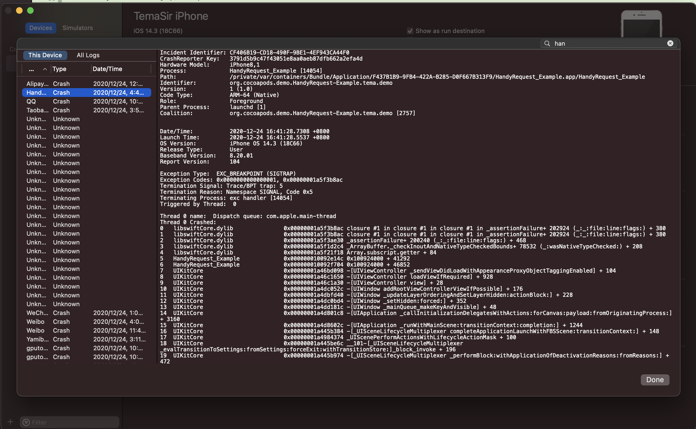
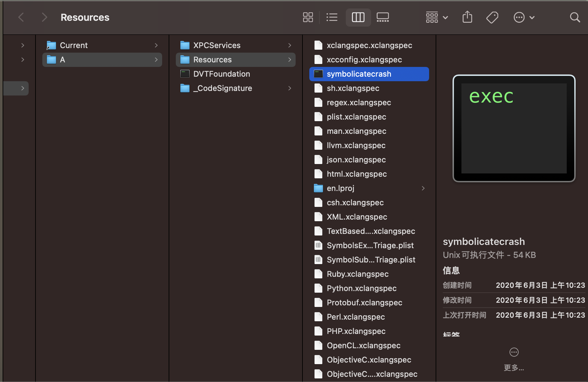
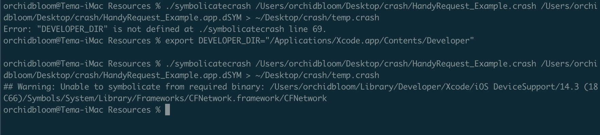

## 使用symbolicatecrash分析crash文件
##### 1、打开Xcode，Window -> Organizer -> Devices，选择你自己的机器，然后点击View Device Logs，这时候会打开一个小窗口，找到App最近的一次崩溃记录，右键导出。

打开.crash文件，上半部分都是一些基本信息（基本没用），重点看下崩溃部分的记录
##### 2、找到.xcarchive的xxx.app.dSYM（要保证.dsYM，xxx.app， xxx.crash的UUID相等）
+ itunes 后台下载
+  从Archives里面导出一个，保证是发布的包
+  DerivedData build目录下复制一份  

##### 3、终端进入到symbolicatecrash文件目录，生成可以定位问题的.crash文件
```
cd /Applications/Xcode.app/Contents/SharedFrameworks/DVTFoundation.framework/Versions/A/Resources
```

##### 4、执行生成更加容易分析的crash的命令(xxx是App名称)
```
 ./symbolicatecrash /Users/orchidbloom/Desktop/crash/xxx.crash /Users/orchidbloom/Desktop/xxx.app.dSYM > ~/Desktop/debug.crash
```

终端可能会报错Error: "DEVELOPER_DIR" is not defined at /usr/local/bin/symbolicatecrash line 53. 

找不到环境变量，终端执行

```
export DEVELOPER_DIR="/Applications/Xcode.app/Contents/Developer"
```


再跑一下就可以拿到具体的错误信息了