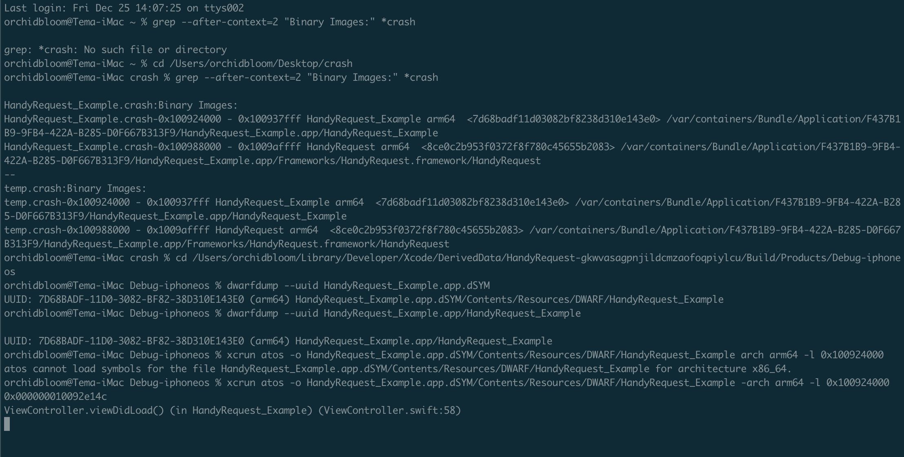

## 使用命令行工具 atos

###### symbolicatecrash 可以帮助我们很好的分析 crash 日志，但是有它的局限性 --- 不够灵活。我们需要 symbolicatecrash、.crash 及 .dSYM 三个文件才能解析。

###### 相对于 symbolicatecrash， atos 命令更加灵活，特别是你需要对不同渠道的 crash 文件，写一个自动化的分析脚本的时候，这个方法就极其有用。

###### 但是这种方式也有个不方便的地方：一个线上的 App，用户使用的版本存在差异，而每个版本所对应的 .dSYM 都是不同的。必须确保 .crash 和 .dSYM 文件是匹配的，才能正确符号化，匹配的条件就是它们的 UUID 一致。

##### 在这之前，先介绍下 UUID：
UUID 是由一组 32 位数的十六进制数字所构成。每一个可执行程序都有一个 build UUID 唯一标识。.crash日志包含发生 crash 的这个应用的 build UUID 以及 crash 发生时，应用加载的所有库文件的 build UUID。

##### 获取 UUID

##### 1、获取 .crash UUID
进入到导出 .crash 文件的的目录下

```
cd /Users/orchidbloom/Desktop/crash
```

执行命令:

```
grep --after-context=2 "Binary Images:" *crash
```

输出:

```
HandyRequest_Example.crash:Binary Images:
HandyRequest_Example.crash-0x100924000 - 0x100937fff HandyRequest_Example arm64  <7d68badf11d03082bf8238d310e143e0> /var/containers/Bundle/Application/F437B1B9-9FB4-422A-B285-D0F667B313F9/HandyRequest_Example.app/HandyRequest_Example
HandyRequest_Example.crash-0x100988000 - 0x1009affff HandyRequest arm64  <8ce0c2b953f0372f8f780c45655b2083> /var/containers/Bundle/Application/F437B1B9-9FB4-422A-B285-D0F667B313F9/HandyRequest_Example.app/Frameworks/HandyRequest.framework/HandyRequest
--
temp.crash:Binary Images:
temp.crash-0x100924000 - 0x100937fff HandyRequest_Example arm64  <7d68badf11d03082bf8238d310e143e0> /var/containers/Bundle/Application/F437B1B9-9FB4-422A-B285-D0F667B313F9/HandyRequest_Example.app/HandyRequest_Example
temp.crash-0x100988000 - 0x1009affff HandyRequest arm64  <8ce0c2b953f0372f8f780c45655b2083> /var/containers/Bundle/Application/F437B1B9-9FB4-422A-B285-D0F667B313F9/HandyRequest_Example.app/Frameworks/HandyRequest.framework/HandyRequest
```

上面输出的7d68badf11d03082bf8238d310e143e0就是HandyRequest_Example项目的UUID
###### （请注意这里的0x100924000，是模块的加载地址，后面用atos的时候会用到）

##### 2、获取 .dSYM UUID

进入到包含.dSYM文件的目录下执行：

```
cd /Users/orchidbloom/Library/Developer/Xcode/DerivedData/HandyRequest-gkwvasagpnjildcmzaofoqpiylcu/Build/Products/Debug-iphoneos

dwarfdump --uuid HandyRequest_Example.app.dSYM
```
输出

```
UUID: 7D68BADF-11D0-3082-BF82-38D310E143E0 (arm64) HandyRequest_Example.app.dSYM/Contents/Resources/DWARF/HandyRequest_Example
```

##### 3、获取 .app UUID
进入到包含.app 的目录下执行

```
dwarfdump --uuid HandyRequest_Example.app/HandyRequest_Example
```
 
 输出：
 
 ```
 UUID: 7D68BADF-11D0-3082-BF82-38D310E143E0 (arm64) HandyRequest_Example.app/HandyRequest_Example
 ```

可以发现.app UUID与.dSYM UUID是相同的，也就是匹配的，只有满足这种条件，才能正确的解析！

### atos 解析

我们先来看下.crash的调用堆栈

```
Incident Identifier: CF406B19-CD18-490F-9BE1-4EF943CA44F0
CrashReporter Key:   3791d5b9c47f43051e8aa0aeb87dfb662a2efa4d
Hardware Model:      iPhone8,1
Process:             HandyRequest_Example [14054]
Path:                /private/var/containers/Bundle/Application/F437B1B9-9FB4-422A-B285-D0F667B313F9/HandyRequest_Example.app/HandyRequest_Example
Identifier:          org.cocoapods.demo.HandyRequest-Example.tema.demo
Version:             1 (1.0)
Code Type:           ARM-64 (Native)
Role:                Foreground
Parent Process:      launchd [1]
Coalition:           org.cocoapods.demo.HandyRequest-Example.tema.demo [2757]


Date/Time:           2020-12-24 16:41:28.7308 +0800
Launch Time:         2020-12-24 16:41:28.5537 +0800
OS Version:          iPhone OS 14.3 (18C66)
Release Type:        User
Baseband Version:    8.20.01
Report Version:      104

Exception Type:  EXC_BREAKPOINT (SIGTRAP)
Exception Codes: 0x0000000000000001, 0x00000001a5f3b8ac
Termination Signal: Trace/BPT trap: 5
Termination Reason: Namespace SIGNAL, Code 0x5
Terminating Process: exc handler [14054]
Triggered by Thread:  0

Thread 0 name:  Dispatch queue: com.apple.main-thread
Thread 0 Crashed:
0   libswiftCore.dylib            	0x00000001a5f3b8ac closure #1 in closure #1 in closure #1 in _assertionFailure+ 202924 (_:_:file:line:flags:) + 380
1   libswiftCore.dylib            	0x00000001a5f3b8ac closure #1 in closure #1 in closure #1 in _assertionFailure+ 202924 (_:_:file:line:flags:) + 380
2   libswiftCore.dylib            	0x00000001a5f3ae30 _assertionFailure+ 200240 (_:_:file:line:flags:) + 468
3   libswiftCore.dylib            	0x00000001a5f1d2c4 _ArrayBuffer._checkInoutAndNativeTypeCheckedBounds+ 78532 (_:wasNativeTypeChecked:) + 208
4   libswiftCore.dylib            	0x00000001a5f21f18 Array.subscript.getter + 84
5   HandyRequest_Example          	0x000000010092e14c 0x100924000 + 41292
6   HandyRequest_Example          	0x000000010092f704 0x100924000 + 46852
7   UIKitCore                     	0x00000001a46bd098 -[UIViewController _sendViewDidLoadWithAppearanceProxyObjectTaggingEnabled] + 104
8   UIKitCore                     	0x00000001a46c1650 -[UIViewController loadViewIfRequired] + 928
9   UIKitCore                     	0x00000001a46c1a30 -[UIViewController view] + 28
10  UIKitCore                     	0x00000001a4dc052c -[UIWindow addRootViewControllerViewIfPossible] + 176
11  UIKitCore                     	0x00000001a4dbfd40 -[UIWindow _updateLayerOrderingAndSetLayerHidden:actionBlock:] + 228
12  UIKitCore                     	0x00000001a4dc0bd4 -[UIWindow _setHidden:forced:] + 352
13  UIKitCore                     	0x00000001a4dd181c -[UIWindow _mainQueue_makeKeyAndVisible] + 48
14  UIKitCore                     	0x00000001a4d801c8 -[UIApplication _callInitializationDelegatesWithActions:forCanvas:payload:fromOriginatingProcess:] + 3160
15  UIKitCore                     	0x00000001a4d8602c -[UIApplication _runWithMainScene:transitionContext:completion:] + 1244
16  UIKitCore                     	0x00000001a445b384 -[_UISceneLifecycleMultiplexer completeApplicationLaunchWithFBSScene:transitionContext:] + 148
17  UIKitCore                     	0x00000001a4984374 _UIScenePerformActionsWithLifecycleActionMask + 100
18  UIKitCore                     	0x00000001a445be6c __101-[_UISceneLifecycleMultiplexer _evalTransitionToSettings:fromSettings:forceExit:withTransitionStore:]_block_invoke + 196
19  UIKitCore                     	0x00000001a445b974 -[_UISceneLifecycleMultiplexer _performBlock:withApplicationOfDeactivationReasons:fromReasons:] + 472
20  UIKitCore                     	0x00000001a445bc98 -[_UISceneLifecycleMultiplexer _evalTransitionToSettings:fromSettings:forceExit:withTransitionStore:] + 740
21  UIKitCore                     	0x00000001a445b554 -[_UISceneLifecycleMultiplexer uiScene:transitionedFromState:withTransitionContext:] + 336
22  UIKitCore                     	0x00000001a4463200 __186-[_UIWindowSceneFBSSceneTransitionContextDrivenLifecycleSettingsDiffAction _performActionsForUIScene:withUpdatedFBSScene:settingsDiff:fromSettings:transitionContext:lifecycleActionType:]_block_invoke + 188
23  UIKitCore                     	0x00000001a489d288 +[BSAnimationSettings+ 6591112 (UIKit) tryAnimatingWithSettings:actions:completion:] + 812
24  UIKitCore                     	0x00000001a499ba9c _UISceneSettingsDiffActionPerformChangesWithTransitionContext + 244
25  UIKitCore                     	0x00000001a4462ef4 -[_UIWindowSceneFBSSceneTransitionContextDrivenLifecycleSettingsDiffAction _performActionsForUIScene:withUpdatedFBSScene:settingsDiff:fromSettings:transitionContext:lifecycleActionType:] + 356
26  UIKitCore                     	0x00000001a42a1bd8 __64-[UIScene scene:didUpdateWithDiff:transitionContext:completion:]_block_invoke + 772
27  UIKitCore                     	0x00000001a42a0678 -[UIScene _emitSceneSettingsUpdateResponseForCompletion:afterSceneUpdateWork:] + 248
28  UIKitCore                     	0x00000001a42a1824 -[UIScene scene:didUpdateWithDiff:transitionContext:completion:] + 220
29  UIKitCore                     	0x00000001a4d84204 -[UIApplication workspace:didCreateScene:withTransitionContext:completion:] + 548
30  UIKitCore                     	0x00000001a48c3b7c -[UIApplicationSceneClientAgent scene:didInitializeWithEvent:completion:] + 360
31  FrontBoardServices            	0x00000001b1827704 -[FBSScene _callOutQueue_agent_didCreateWithTransitionContext:completion:] + 404
32  FrontBoardServices            	0x00000001b184f130 __94-[FBSWorkspaceScenesClient createWithSceneID:groupID:parameters:transitionContext:completion:]_block_invoke.176 + 100
33  FrontBoardServices            	0x00000001b1834e60 -[FBSWorkspace _calloutQueue_executeCalloutFromSource:withBlock:] + 232
34  FrontBoardServices            	0x00000001b184ee44 __94-[FBSWorkspaceScenesClient createWithSceneID:groupID:parameters:transitionContext:completion:]_block_invoke + 312
35  libdispatch.dylib             	0x00000001a2152280 _dispatch_client_callout + 16
36  libdispatch.dylib             	0x00000001a20f7930 _dispatch_block_invoke_direct$VARIANT$mp + 224
37  FrontBoardServices            	0x00000001b1873e60 __FBSSERIALQUEUE_IS_CALLING_OUT_TO_A_BLOCK__ + 40
38  FrontBoardServices            	0x00000001b1873b28 -[FBSSerialQueue _targetQueue_performNextIfPossible] + 404
39  FrontBoardServices            	0x00000001b1873ffc -[FBSSerialQueue _performNextFromRunLoopSource] + 28
40  CoreFoundation                	0x00000001a2499bf0 __CFRUNLOOP_IS_CALLING_OUT_TO_A_SOURCE0_PERFORM_FUNCTION__ + 24
41  CoreFoundation                	0x00000001a2499af0 __CFRunLoopDoSource0 + 204
42  CoreFoundation                	0x00000001a2498e38 __CFRunLoopDoSources0 + 256
43  CoreFoundation                	0x00000001a24933e0 __CFRunLoopRun + 776
44  CoreFoundation                	0x00000001a2492ba0 CFRunLoopRunSpecific + 572
45  GraphicsServices              	0x00000001b91d0598 GSEventRunModal + 160
46  UIKitCore                     	0x00000001a4d823d8 -[UIApplication _run] + 1052
47  UIKitCore                     	0x00000001a4d87958 UIApplicationMain + 164
48  HandyRequest_Example          	0x0000000100933004 0x100924000 + 61444
49  libdyld.dylib                 	0x00000001a2171568 start + 4

Thread 1 name:  Dispatch queue: com.apple.NSURLSession-work
```

执行命令：

```
xcrun atos -o HandyRequest_Example.app.dSYM/Contents/Resources/DWARF/HandyRequest_Example -arch arm64 -l 0x100924000
```

输入:

```
0x000000010092e14c
```

输出：

```
ViewController.viewDidLoad() (in HandyRequest_Example) (ViewController.swift:58)
```
###### （请注意这里的0x000000010092e14c，是模块的偏移位置）

发现ViewController.viewDidLoad 第58行报错，正确解析出来了



### 除了搭配 .dSYM 文件，我们也可以使用 .app 文件来解析：

```
orchidbloom@Tema-iMac ~ % cd /Users/orchidbloom/Library/Developer/Xcode/DerivedData/HandyRequest-gkwvasagpnjildcmzaofoqpiylcu/Build/Products/Debug-iphoneos
orchidbloom@Tema-iMac Debug-iphoneos % xcrun atos -o HandyRequest_Example.app/HandyRequest_Example -arch arm64 -l 0x100924000
0x000000010092e14c
ViewController.viewDidLoad() (in HandyRequest_Example) (ViewController.swift:58)
```

这样就找到了应用种到底是哪个模块导致的crash问题。