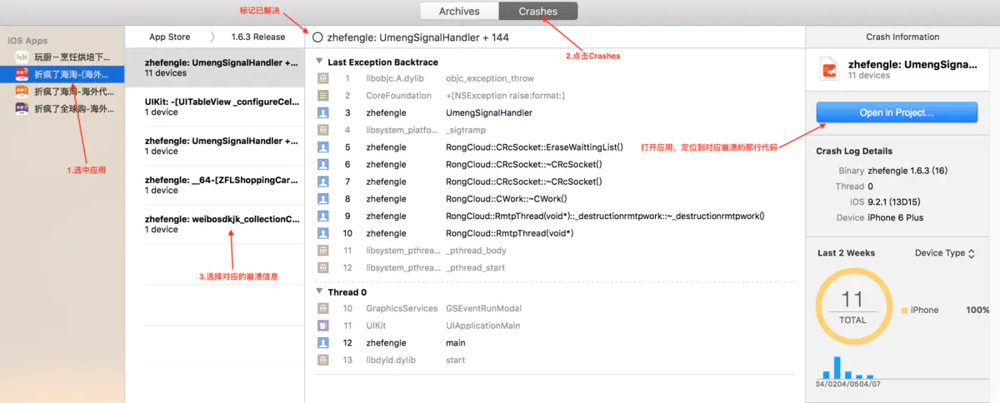

## 崩溃分析
### 1.1 Crash日志（crash log）
#### 1.1.1 在Xcode中查看崩溃日志
Xcode -> Window -> Organizer-> Crashs



#### 1.1.2 根据符号表来检查崩溃位置
#### 什么是符号表
###### 符号表是在Xcode项目编译后，在Build目录下与 xxx.app统计目录的文件后缀名为，dYSM的文件

###### .dSYM文件是个目录文件，在子目录中包含了16进制的保存函数地址映射的中转文件，所有的Debug的symbols都在这个文件中（包括文件名，函数名行号等）。
#### 符号表有什么用
###### 符号表就是用来符号化crash log 崩溃日志的。crash log 中有一些方法16进制的内存数据等，通过符号表就能对应的直观的看到方法名，类等。

#### 如何得到.dsYM文件

###### Archive的时候会生成。.xcarchive文件，显示包内内容就可以找到 .dsYM文件。

#### 如何使用.dsYM
##### 1、第三方日志框架会使用，Firebase, 友盟(有时候自动上传缺失需要手动上传)
#####  2、 或者自己找到.xcarchive文件和错误内存地址(友盟错误详情里标绿色的为错误内存地址)。然后通过一个小应用来分析出对应的函数。[应用下载地址](https://github.com/answer-huang/dSYMTools)
#####  3、命令行工具symbolicatecrash
###### symbolicatecrash是xcode的一个符号化crash log的命令行工具。使用方法也就是导出.crash文件（crash log）和找到.dsYM文件，然后进行分析。
如何使用[symbolicatecrash使用](Symbolicatecrash.md)
#####  4、命令行工具atos
###### 如果你有多个 .ipa 文件， 多个 .dSYM文件，你并不太确定 dSYM文件对应哪个 .ipa 文件，就可以用atos命令行工具。
如何使用[命令行工具atos](atos.md) 

###### 利用 symbolicatecrash 解析，可以将整个 .crash 日志堆栈解析，但是由于依赖 symbolicatecrash、.crash 以及 .dSYM 三个文件，或者 .app 、.crash 及 symbolicatecrash 三个文件，导致不太灵活。
###### 利用 atos 命令只需要 .crash和 .dSYM ，或者 .crash和 .app，知道对应的堆栈地址，就能解析，方便自动化脚本分析，但是 crash 堆栈可能需要自己实现收集。

## 日志分析

什么情况下会产生崩溃日志？

+ 应用违反操作系统规则
+ 应用中有Bug

###### 违反iOS系统规则包含启动、恢复、挂起、退出时watchdog超时，用户强制退出，低内存终止。

#### Watchdog超时机制
从iOS 4开始，退出应用时，应用不会立即终止，而是退到后台，但是如果你的应该相应地不够快，操作系统有可能会终止你的应用，并产生一个崩溃日志，这些事件与UIApplicationDelegate的方法相对应：

```
application:didFinishLaunchingWithOptions:
applicationWillResignActive:
applicationDidEnterBackground:
applicationWillEnterForeground:
applicationDidBecomeActive:
applicationWillTerminate:
``` 
上述所有这些方法，应用只有有限的时间去处理，如果花费时间太长，操作系统将终止应用。（例如同步的网络访问）

#### 用户强制退出

iOS 4.x开始支持多任务，如果应用阻塞界面并停止响应，应用可以通过双击Home按钮来终止应用。
通常应用退到后台后保留19分钟，然后操作系统将其终止，所以双击Home键看到的是过去打开的应用，删除那些应用不会产生任何的崩溃日志。

#### 低内存终止

### 崩溃日志的实例

```
// 1、进程信息
Incident Identifier: CF406B19-CD18-490F-9BE1-4EF943CA44F0
CrashReporter Key:   3791d5b9c47f43051e8aa0aeb87dfb662a2efa4d
Hardware Model:      iPhone8,1
Process:             HandyRequest_Example [14054]
Path:                /private/var/containers/Bundle/Application/F437B1B9-9FB4-422A-B285-D0F667B313F9/HandyRequest_Example.app/HandyRequest_Example
Identifier:          org.cocoapods.demo.HandyRequest-Example.tema.demo
Version:             1 (1.0)
Code Type:           ARM-64 (Native)
Role:                Foreground
Parent Process:      launchd [1]
Coalition:           org.cocoapods.demo.HandyRequest-Example.tema.demo [2757]

//2、基本信息
Date/Time:           2020-12-24 16:41:28.7308 +0800
Launch Time:         2020-12-24 16:41:28.5537 +0800
OS Version:          iPhone OS 14.3 (18C66)
Release Type:        User
Baseband Version:    8.20.01
Report Version:      104
// 3、异常
Exception Type:  EXC_BREAKPOINT (SIGTRAP)
Exception Codes: 0x0000000000000001, 0x00000001a5f3b8ac
Termination Signal: Trace/BPT trap: 5
Termination Reason: Namespace SIGNAL, Code 0x5
Terminating Process: exc handler [14054]
Triggered by Thread:  0
// 4、线程回溯
Thread 0 name:  Dispatch queue: com.apple.main-thread
Thread 0 Crashed:
0   libswiftCore.dylib            	0x00000001a5f3b8ac closure #1 in closure #1 in closure #1 in _assertionFailure+ 202924 (_:_:file:line:flags:) + 380
1   libswiftCore.dylib            	0x00000001a5f3b8ac closure #1 in closure #1 in closure #1 in _assertionFailure+ 202924 (_:_:file:line:flags:) + 380
2   libswiftCore.dylib            	0x00000001a5f3ae30 _assertionFailure+ 200240 (_:_:file:line:flags:) + 468
3   libswiftCore.dylib            	0x00000001a5f1d2c4 _ArrayBuffer._checkInoutAndNativeTypeCheckedBounds+ 78532 (_:wasNativeTypeChecked:) + 208
4   libswiftCore.dylib            	0x00000001a5f21f18 Array.subscript.getter + 84
5   HandyRequest_Example          	0x000000010092e14c ViewController.viewDidLoad() + 41292 (ViewController.swift:58)
6   HandyRequest_Example          	0x000000010092f704 @objc ViewController.viewDidLoad() + 46852 (<compiler-generated>:0)
7   UIKitCore                     	0x00000001a46bd098 -[UIViewController _sendViewDidLoadWithAppearanceProxyObjectTaggingEnabled] + 104
8   UIKitCore                     	0x00000001a46c1650 -[UIViewController loadViewIfRequired] + 928
9   UIKitCore                     	0x00000001a46c1a30 -[UIViewController view] + 28
10  UIKitCore                     	0x00000001a4dc052c -[UIWindow addRootViewControllerViewIfPossible] + 176
11  UIKitCore                     	0x00000001a4dbfd40 -[UIWindow _updateLayerOrderingAndSetLayerHidden:actionBlock:] + 228
12  UIKitCore                     	0x00000001a4dc0bd4 -[UIWindow _setHidden:forced:] + 352
13  UIKitCore                     	0x00000001a4dd181c -[UIWindow _mainQueue_makeKeyAndVisible] + 48
14  UIKitCore                     	0x00000001a4d801c8 -[UIApplication _callInitializationDelegatesWithActions:forCanvas:payload:fromOriginatingProcess:] + 3160
15  UIKitCore                     	0x00000001a4d8602c -[UIApplication _runWithMainScene:transitionContext:completion:] + 1244
16  UIKitCore                     	0x00000001a445b384 -[_UISceneLifecycleMultiplexer completeApplicationLaunchWithFBSScene:transitionContext:] + 148
17  UIKitCore                     	0x00000001a4984374 _UIScenePerformActionsWithLifecycleActionMask + 100
18  UIKitCore                     	0x00000001a445be6c __101-[_UISceneLifecycleMultiplexer _evalTransitionToSettings:fromSettings:forceExit:withTransitionStore:]_block_invoke + 196
19  UIKitCore                     	0x00000001a445b974 -[_UISceneLifecycleMultiplexer _performBlock:withApplicationOfDeactivationReasons:fromReasons:] + 472
20  UIKitCore                     	0x00000001a445bc98 -[_UISceneLifecycleMultiplexer _evalTransitionToSettings:fromSettings:forceExit:withTransitionStore:] + 740
21  UIKitCore                     	0x00000001a445b554 -[_UISceneLifecycleMultiplexer uiScene:transitionedFromState:withTransitionContext:] + 336
22  UIKitCore                     	0x00000001a4463200 __186-[_UIWindowSceneFBSSceneTransitionContextDrivenLifecycleSettingsDiffAction _performActionsForUIScene:withUpdatedFBSScene:settingsDiff:fromSettings:transitionContext:lifecycleActionType:]_block_invoke + 188
23  UIKitCore                     	0x00000001a489d288 +[BSAnimationSettings+ 6591112 (UIKit) tryAnimatingWithSettings:actions:completion:] + 812
24  UIKitCore                     	0x00000001a499ba9c _UISceneSettingsDiffActionPerformChangesWithTransitionContext + 244
25  UIKitCore                     	0x00000001a4462ef4 -[_UIWindowSceneFBSSceneTransitionContextDrivenLifecycleSettingsDiffAction _performActionsForUIScene:withUpdatedFBSScene:settingsDiff:fromSettings:transitionContext:lifecycleActionType:] + 356
26  UIKitCore                     	0x00000001a42a1bd8 __64-[UIScene scene:didUpdateWithDiff:transitionContext:completion:]_block_invoke + 772
27  UIKitCore                     	0x00000001a42a0678 -[UIScene _emitSceneSettingsUpdateResponseForCompletion:afterSceneUpdateWork:] + 248
28  UIKitCore                     	0x00000001a42a1824 -[UIScene scene:didUpdateWithDiff:transitionContext:completion:] + 220
29  UIKitCore                     	0x00000001a4d84204 -[UIApplication workspace:didCreateScene:withTransitionContext:completion:] + 548
30  UIKitCore                     	0x00000001a48c3b7c -[UIApplicationSceneClientAgent scene:didInitializeWithEvent:completion:] + 360
31  FrontBoardServices            	0x00000001b1827704 -[FBSScene _callOutQueue_agent_didCreateWithTransitionContext:completion:] + 404
32  FrontBoardServices            	0x00000001b184f130 __94-[FBSWorkspaceScenesClient createWithSceneID:groupID:parameters:transitionContext:completion:]_block_invoke.176 + 100
33  FrontBoardServices            	0x00000001b1834e60 -[FBSWorkspace _calloutQueue_executeCalloutFromSource:withBlock:] + 232
34  FrontBoardServices            	0x00000001b184ee44 __94-[FBSWorkspaceScenesClient createWithSceneID:groupID:parameters:transitionContext:completion:]_block_invoke + 312
35  libdispatch.dylib             	0x00000001a2152280 _dispatch_client_callout + 16
36  libdispatch.dylib             	0x00000001a20f7930 _dispatch_block_invoke_direct$VARIANT$mp + 224
37  FrontBoardServices            	0x00000001b1873e60 __FBSSERIALQUEUE_IS_CALLING_OUT_TO_A_BLOCK__ + 40
38  FrontBoardServices            	0x00000001b1873b28 -[FBSSerialQueue _targetQueue_performNextIfPossible] + 404
39  FrontBoardServices            	0x00000001b1873ffc -[FBSSerialQueue _performNextFromRunLoopSource] + 28
40  CoreFoundation                	0x00000001a2499bf0 __CFRUNLOOP_IS_CALLING_OUT_TO_A_SOURCE0_PERFORM_FUNCTION__ + 24
41  CoreFoundation                	0x00000001a2499af0 __CFRunLoopDoSource0 + 204
42  CoreFoundation                	0x00000001a2498e38 __CFRunLoopDoSources0 + 256
43  CoreFoundation                	0x00000001a24933e0 __CFRunLoopRun + 776
44  CoreFoundation                	0x00000001a2492ba0 CFRunLoopRunSpecific + 572
45  GraphicsServices              	0x00000001b91d0598 GSEventRunModal + 160
46  UIKitCore                     	0x00000001a4d823d8 -[UIApplication _run] + 1052
47  UIKitCore                     	0x00000001a4d87958 UIApplicationMain + 164
48  HandyRequest_Example          	0x0000000100933004 main + 61444 (AppDelegate.swift:12)
49  libdyld.dylib                 	0x00000001a2171568 start + 4

Thread 1 name:  Dispatch queue: com.apple.NSURLSession-work
Thread 1:
0   CFNetwork                     	0x00000001a2afeff0 0x1a2af2000 + 53232
1   CFNetwork                     	0x00000001a2afeff0 0x1a2af2000 + 53232
2   CFNetwork                     	0x00000001a2b0eeb8 0x1a2af2000 + 118456
3   CFNetwork                     	0x00000001a2af5bf4 0x1a2af2000 + 15348
4   CFNetwork                     	0x00000001a2af5f3c 0x1a2af2000 + 16188
5   CFNetwork                     	0x00000001a2af408c 0x1a2af2000 + 8332
6   CFNetwork                     	0x00000001a2d3c2d0 0x1a2af2000 + 2400976
7   libdispatch.dylib             	0x00000001a2151298 _dispatch_call_block_and_release + 24
8   libdispatch.dylib             	0x00000001a2152280 _dispatch_client_callout + 16
9   libdispatch.dylib             	0x00000001a20fadcc _dispatch_lane_serial_drain$VARIANT$mp + 612
10  libdispatch.dylib             	0x00000001a20fb8d8 _dispatch_lane_invoke$VARIANT$mp + 472
11  libdispatch.dylib             	0x00000001a2105338 _dispatch_workloop_worker_thread + 712
12  libsystem_pthread.dylib       	0x00000001eac135a4 _pthread_wqthread + 272
13  libsystem_pthread.dylib       	0x00000001eac16874 start_wqthread + 8

Thread 2:
0   libsystem_pthread.dylib       	0x00000001eac1686c start_wqthread + 0

Thread 3:
0   libsystem_pthread.dylib       	0x00000001eac1686c start_wqthread + 0

Thread 4 name:  com.apple.uikit.eventfetch-thread
Thread 4:
0   libsystem_kernel.dylib        	0x00000001ce2b9644 mach_msg_trap + 8
1   libsystem_kernel.dylib        	0x00000001ce2b8a48 mach_msg + 72
2   CoreFoundation                	0x00000001a24990fc __CFRunLoopServiceMachPort + 376
3   CoreFoundation                	0x00000001a2493570 __CFRunLoopRun + 1176
4   CoreFoundation                	0x00000001a2492ba0 CFRunLoopRunSpecific + 572
5   Foundation                    	0x00000001a36b27f8 -[NSRunLoop+ 30712 (NSRunLoop) runMode:beforeDate:] + 228
6   Foundation                    	0x00000001a36b26d8 -[NSRunLoop+ 30424 (NSRunLoop) runUntilDate:] + 88
7   UIKitCore                     	0x00000001a4e2e140 -[UIEventFetcher threadMain] + 504
8   Foundation                    	0x00000001a380f4bc __NSThread__start__ + 848
9   libsystem_pthread.dylib       	0x00000001eac11b3c _pthread_start + 288
10  libsystem_pthread.dylib       	0x00000001eac16880 thread_start + 8

Thread 5:
0   libsystem_pthread.dylib       	0x00000001eac1686c start_wqthread + 0

Thread 6:
0   libsystem_pthread.dylib       	0x00000001eac1686c start_wqthread + 0
// 5、线程状态
Thread 0 crashed with ARM Thread State (64-bit):
    x0: 0x0000000100bfc000   x1: 0x0000000282197900   x2: 0x0000000000000007   x3: 0x00000001b18a1850
    x4: 0x0000000000000000   x5: 0x000000016f4d88e0   x6: 0x0000000000000065   x7: 0x00000000000003f8
    x8: 0x00000000ac2067fb   x9: 0x000000000000007f  x10: 0x0000000000000073  x11: 0x00000000000007fb
   x12: 0x00000000000007fd  x13: 0x0000000000000000  x14: 0x00000000ac406800  x15: 0x000000000000000d
   x16: 0x0000000080000000  x17: 0x000000002c400000  x18: 0x0000000000000000  x19: 0x00000000000001bc
   x20: 0x0000000000000000  x21: 0x0000000000000002  x22: 0x0000000000000002  x23: 0x0000000000000012
   x24: 0x00000001a6288100  x25: 0x00000001fb58a000  x26: 0x000000010160a4a0  x27: 0x0000000101605510
   x28: 0x00000001a6288094   fp: 0x000000016f4d8990   lr: 0x00000001a5f3b8ac
    sp: 0x000000016f4d8970   pc: 0x00000001a5f3b8ac cpsr: 0x60000000
   esr: 0xf2000001  Address size fault
// 6加载的二进制库
Binary Images:
0x100924000 - 0x100937fff HandyRequest_Example arm64  <7d68badf11d03082bf8238d310e143e0> /var/containers/Bundle/Application/F437B1B9-9FB4-422A-B285-D0F667B313F9/HandyRequest_Example.app/HandyRequest_Example
0x100988000 - 0x1009affff HandyRequest arm64  <8ce0c2b953f0372f8f780c45655b2083> /var/containers/Bundle/Application/F437B1B9-9FB4-422A-B285-D0F667B313F9/HandyRequest_Example.app/Frameworks/HandyRequest.framework/HandyRequest
0x100a00000 - 0x100a3ffff Moya arm64  <f0a86ebac5df3bba83dfc9535a300b9c> /var/containers/Bundle/Application/F437B1B9-9FB4-422A-B285-D0F667B313F9/HandyRequest_Example.app/Frameworks/Moya.framework/Moya
0x100ab4000 - 0x100b07fff ObjectMapper arm64  <50855f6b906b351e8a4a714791618cda> /var/containers/Bundle/Application/F437B1B9-9FB4-422A-B285-D0F667B313F9/HandyRequest_Example.app/Frameworks/ObjectMapper.framework/ObjectMapper
0x100b6c000 - 0x100b93fff SwiftyJSON arm64  <bf640f2209dd3689b086c365445dbcab> /var/containers/Bundle/Application/F437B1B9-9FB4-422A-B285-D0F667B313F9/HandyRequest_Example.app/Frameworks/SwiftyJSON.framework/SwiftyJSON
0x100c8c000 - 0x100c97fff libobjc-trampolines.dylib arm64  <833827b87b6638cfa623a35284137323> /usr/lib/libobjc-trampolines.dylib
0x100ca8000 - 0x100d13fff dyld arm64  <2b1346e7da2436ce9b40ef41f2103dd7> /usr/lib/dyld
0x100d94000 - 0x100f0bfff Alamofire arm64  <89a9ed00df5b3f4c8047519c21a651f2> /var/containers/Bundle/Application/F437B1B9-9FB4-422A-B285-D0F667B313F9/HandyRequest_Example.app/Frameworks/Alamofire.framework/Alamofire
0x101140000 - 0x1012e3fff RxSwift arm64  <faad246555813f18aa47b0c78fa05269> /var/containers/Bundle/Application/F437B1B9-9FB4-422A-B285-D0F667B313F9/HandyRequest_Example.app/Frameworks/RxSwift.framework/RxSwift
0x1a20f1000 - 0x1a216ffff libdispatch.dylib arm64  <04b54a988ead371e8c12ad116cb118e2> /usr/lib/system/libdispatch.dylib
0x1a2170000 - 0x1a21a6fff libdyld.dylib arm64  <fc5d448b5ee3378686e7cce6c21a212b> /usr/lib/system/libdyld.dylib
0x1a21a7000 - 0x1a23fefff libicucore.A.dylib arm64  <c62b0743378f3c43a8e3bb2f5bd04bb2> /usr/lib/libicucore.A.dylib
0x1a23ff000 - 0x1a27a8fff CoreFoundation arm64  <6fd5304a97593e22a863456eab55f4cc> /System/Library/Frameworks/CoreFoundation.framework/CoreFoundation
0x1a27a9000 - 0x1a2943fff CoreServices arm64  <1788dcaab5f935d3a24758c7de08465b> /System/Library/Frameworks/CoreServices.framework/CoreServices
0x1a298d000 - 0x1a2a06fff SystemConfiguration arm64  <7a2e540eb65d3aa7b9e081126a3f6b90> /System/Library/Frameworks/SystemConfiguration.framework/SystemConfiguration
0x1a2a07000 - 0x1a2af1fff CoreTelephony arm64  <bf50fcf7468a3016b53e88aa64b7f74e> /System/Library/Frameworks/CoreTelephony.framework/CoreTelephony
0x1a2af2000 - 0x1a2f73fff CFNetwork arm64  <beecfe4fc9ef3bb5a7b450521814201f> /System/Library/Frameworks/CFNetwork.framework/CFNetwork
0x1a2f74000 - 0x1a3639fff libnetwork.dylib arm64  <8d385d9d117b311a9579f209b9d6f9d8> /usr/lib/libnetwork.dylib
0x1a363a000 - 0x1a36aafff Accounts arm64  <3e65e1a76fa438a59f7ca1671fdb7677> /System/Library/Frameworks/Accounts.framework/Accounts
0x1a36ab000 - 0x1a3945fff Foundation arm64  <db4d183e0dd93ce4990c44d1c3982206> /System/Library/Frameworks/Foundation.framework/Foundation
0x1a3946000 - 0x1a3caafff ImageIO arm64  <ac443dee4c913345bf4004422f4ffc6e> /System/Library/Frameworks/ImageIO.framework/ImageIO
0x1a3cc4000 - 0x1a4253fff CoreGraphics arm64  <adb2e701ba7434b2b37d310c807c686f> /System/Library/Frameworks/CoreGraphics.framework/CoreGraphics
0x1a4254000 - 0x1a561dfff UIKitCore arm64  <3405666ff2813f71ba8683e5a27ab5b0> /System/Library/PrivateFrameworks/UIKitCore.framework/UIKitCore
0x1a561e000 - 0x1a563bfff libAccessibility.dylib arm64  <1997f22d363d36e49100d29a6773deed> /usr/lib/libAccessibility.dylib
0x1a563c000 - 0x1a58b1fff QuartzCore arm64  <add890c7575836e3a0e8a6dfc67111e0> /System/Library/Frameworks/QuartzCore.framework/QuartzCore
0x1a58b2000 - 0x1a5917fff BackBoardServices arm64  <7f1f28c8114133f28e653628bf800ccf> /System/Library/PrivateFrameworks/BackBoardServices.framework/BackBoardServices
0x1a5918000 - 0x1a599ffff TextInput arm64  <f836876caec33e23b587a2b2fd02d203> /System/Library/PrivateFrameworks/TextInput.framework/TextInput
0x1a5da6000 - 0x1a5f09fff libswiftFoundation.dylib arm64  <85875bd7ed5b3eff95e4ff90a4e2642d> /usr/lib/swift/libswiftFoundation.dylib
0x1a5f0a000 - 0x1a62b9fff libswiftCore.dylib arm64  <6d35f5030792349d842074bdcb45c28b> /usr/lib/swift/libswiftCore.dylib
0x1a62ba000 - 0x1a62d1fff UIKitServices arm64  <e7de6bc4a91d30f9b52a5f8100d2327d> /System/Library/PrivateFrameworks/UIKitServices.framework/UIKitServices
0x1a662c000 - 0x1a67e5fff CoreText arm64  <9f393fdf41463994a0f4533c6e66410f> /System/Library/Frameworks/CoreText.framework/CoreText
0x1a67e6000 - 0x1a67fffff ExtensionKit arm64  <1232b11d27ce386690e4452f45a412d0> /System/Library/PrivateFrameworks/ExtensionKit.framework/ExtensionKit
0x1a6814000 - 0x1a6891fff BaseBoard arm64  <cae6f455259034c6b03d23e553a52d41> /System/Library/PrivateFrameworks/BaseBoard.framework/BaseBoard
0x1a828f000 - 0x1a85f7fff CoreData arm64  <c64cb1615498395282d49794c40c64e8> /System/Library/Frameworks/CoreData.framework/CoreData
0x1a91e7000 - 0x1a91f1fff libswiftCoreGraphics.dylib arm64  <484fb54ad27b3acf9c4303f3c2e010bd> /usr/lib/swift/libswiftCoreGraphics.dylib
0x1a91f2000 - 0x1a9230fff AppSupport arm64  <405f6c340f073e52bf354adc72064fd3> /System/Library/PrivateFrameworks/AppSupport.framework/AppSupport
0x1a9231000 - 0x1a934efff ManagedConfiguration arm64  <1e147c35a3783f4ca916dbb59c1c0e72> /System/Library/PrivateFrameworks/ManagedConfiguration.framework/ManagedConfiguration
0x1a94bf000 - 0x1a95fdfff Security arm64  <d8db7fece7333e9380fde89cf32012e1> /System/Library/Frameworks/Security.framework/Security
0x1aa146000 - 0x1aa445fff CoreImage arm64  <cf9887dda2843db0b2b3c4e263f2d09f> /System/Library/Frameworks/CoreImage.framework/CoreImage
0x1aa446000 - 0x1aa500fff ColorSync arm64  <3355ffd993953a309902793fb0ce2d33> /System/Library/PrivateFrameworks/ColorSync.framework/ColorSync
0x1aa501000 - 0x1aa539fff CoreVideo arm64  <4e304b7c33d43dccb4dca2f3d299b20c> /System/Library/Frameworks/CoreVideo.framework/CoreVideo
0x1aac5f000 - 0x1aad51fff CoreMedia arm64  <6b67e4577230339291433c2f58799baa> /System/Library/Frameworks/CoreMedia.framework/CoreMedia
0x1aad52000 - 0x1aafbdfff AudioToolbox arm64  <95158015ebde39f8b120c35ea9a633c2> /System/Library/Frameworks/AudioToolbox.framework/AudioToolbox
0x1ab06b000 - 0x1ab16dfff UIFoundation arm64  <e279570705a13c648ab37b267e157bc5> /System/Library/PrivateFrameworks/UIFoundation.framework/UIFoundation
0x1ab16e000 - 0x1ab193fff libsystem_info.dylib arm64  <c8bfb9c963183796b80f5936e5f9a4d3> /usr/lib/system/libsystem_info.dylib
0x1ab194000 - 0x1ab210fff libsystem_c.dylib arm64  <abf42b71753f3c1c8184960651eb9cc6> /usr/lib/system/libsystem_c.dylib
0x1ab211000 - 0x1ab259fff RunningBoardServices arm64  <0b229ce295a831018891289581a83b96> /System/Library/PrivateFrameworks/RunningBoardServices.framework/RunningBoardServices
0x1ab25a000 - 0x1ac30bfff JavaScriptCore arm64  <992c88f15507357dabcc2cf1bb04e37f> /System/Library/Frameworks/JavaScriptCore.framework/JavaScriptCore
0x1acc79000 - 0x1acd1ffff IOKit arm64  <6a9cfcbc84353392841b3eb78fb93818> /System/Library/Frameworks/IOKit.framework/Versions/A/IOKit
0x1acd20000 - 0x1acd2ffff DataMigration arm64  <bb496fce480d3c40a053994fd5dcdd4a> /System/Library/PrivateFrameworks/DataMigration.framework/DataMigration
0x1acd30000 - 0x1acd88fff SpringBoardServices arm64  <5215a2b14eab3970961a8d546f38d05b> /System/Library/PrivateFrameworks/SpringBoardServices.framework/SpringBoardServices
0x1ad8d2000 - 0x1ada6afff CoreUtils arm64  <0ca3f10b70ce3f96a548cf811a8c24a9> /System/Library/PrivateFrameworks/CoreUtils.framework/CoreUtils
0x1ae06c000 - 0x1ae12dfff CoreUI arm64  <b6d2a2c8714b34659167de948cf615ec> /System/Library/PrivateFrameworks/CoreUI.framework/CoreUI
0x1aeb2e000 - 0x1b13d2fff WebCore arm64  <a2e6ffa4e1463636b90fdceeeb172b5d> /System/Library/PrivateFrameworks/WebCore.framework/WebCore
0x1b13d3000 - 0x1b1431fff libMobileGestalt.dylib arm64  <61a19e34dbb53afe902dbbc38d8b9007> /usr/lib/libMobileGestalt.dylib
0x1b1432000 - 0x1b144dfff CommonUtilities arm64  <eec85a75391b30b6a251b7e7bd6b0381> /System/Library/PrivateFrameworks/CommonUtilities.framework/CommonUtilities
0x1b17ed000 - 0x1b181dfff UserNotifications arm64  <9fc804d0e8cb3b729efd62a3a5867e2f> /System/Library/Frameworks/UserNotifications.framework/UserNotifications
0x1b181e000 - 0x1b189ffff FrontBoardServices arm64  <1ae9f5d6f35b37219d7e2ba3a37713af> /System/Library/PrivateFrameworks/FrontBoardServices.framework/FrontBoardServices
0x1b18a0000 - 0x1b18c2fff libsystem_malloc.dylib arm64  <6dfd20b241d13689b01607374d3fb040> /usr/lib/system/libsystem_malloc.dylib
0x1b234b000 - 0x1b23d4fff AuthKit arm64  <9607917f6d1735a4b88155d8767d62cb> /System/Library/PrivateFrameworks/AuthKit.framework/AuthKit
0x1b256a000 - 0x1b27c9fff AudioToolboxCore arm64  <72c0f2f8b4613a84ae1beab934568f3f> /System/Library/PrivateFrameworks/AudioToolboxCore.framework/AudioToolboxCore
0x1b2c09000 - 0x1b2ca9fff ShareSheet arm64  <6653c4e4174b3946ae7470e25666b445> /System/Library/PrivateFrameworks/ShareSheet.framework/ShareSheet
0x1b37f8000 - 0x1b380bfff MSUDataAccessor arm64  <69d9bacca79a341789e297ee334cecf4> /System/Library/PrivateFrameworks/MSUDataAccessor.framework/MSUDataAccessor
0x1b380c000 - 0x1b3831fff MobileAsset arm64  <145a023dc78f34df913d2d9970e35579> /System/Library/PrivateFrameworks/MobileAsset.framework/MobileAsset
0x1b3832000 - 0x1b3841fff libsystem_networkextension.dylib arm64  <297e446abce83a85bd6c2551810e37ed> /usr/lib/system/libsystem_networkextension.dylib
0x1b469f000 - 0x1b4797fff VideoToolbox arm64  <d7285706d66c3fc5b24a3172520ca373> /System/Library/Frameworks/VideoToolbox.framework/VideoToolbox
0x1b48d5000 - 0x1b48e4fff AXCoreUtilities arm64  <df3f570e7fd638a5920fea495b8494ce> /System/Library/PrivateFrameworks/AXCoreUtilities.framework/AXCoreUtilities
0x1b599f000 - 0x1b59a7fff InternationalSupport arm64  <28b2bdf1bd7135e2b676c037a993744c> /System/Library/PrivateFrameworks/InternationalSupport.framework/InternationalSupport
0x1b5be4000 - 0x1b5c20fff libswiftUIKit.dylib arm64  <0b7ab1e90ff23370969b096db6d5e43b> /usr/lib/swift/libswiftUIKit.dylib
0x1b5ef2000 - 0x1b5fe3fff Combine arm64  <61c70e00543834c69e7a12a4fd320c12> /System/Library/Frameworks/Combine.framework/Combine
0x1b606a000 - 0x1b607bfff UniformTypeIdentifiers arm64  <b402f4fa1c5b3a52959cc0f17fc4e38e> /System/Library/Frameworks/UniformTypeIdentifiers.framework/UniformTypeIdentifiers
0x1b687c000 - 0x1b68b1fff libobjc.A.dylib arm64  <a02e71ba05bf35509f577aec2e68ec24> /usr/lib/libobjc.A.dylib
0x1b68b2000 - 0x1b6911fff LoggingSupport arm64  <426c40c342d139abbee4f6f7511f77aa> /System/Library/PrivateFrameworks/LoggingSupport.framework/LoggingSupport
0x1b6912000 - 0x1b696bfff libc++.1.dylib arm64  <61a274a0faff3f58b6b5a38b20c7ae6e> /usr/lib/libc++.1.dylib
0x1b696c000 - 0x1b6984fff libc++abi.dylib arm64  <880953410add302cb3ad258956e2009d> /usr/lib/libc++abi.dylib
0x1b6af6000 - 0x1b6b36fff CoreAutoLayout arm64  <bfa41672e37533c98533aa1936f46191> /System/Library/PrivateFrameworks/CoreAutoLayout.framework/CoreAutoLayout
0x1b6b37000 - 0x1b6c8ffff Network arm64  <93cc69d0182f366e8c0edfa4e1462df0> /System/Library/Frameworks/Network.framework/Network
0x1b6c90000 - 0x1b6cc4fff MobileKeyBag arm64  <f79d9dcf93333bd682a3e1ec18461d2f> /System/Library/PrivateFrameworks/MobileKeyBag.framework/MobileKeyBag
0x1b6f00000 - 0x1b6f9afff libvDSP.dylib arm64  <84f94d1ffff334d5bc3307aeb39b741e> /System/Library/Frameworks/Accelerate.framework/Frameworks/vecLib.framework/libvDSP.dylib
0x1b6f9b000 - 0x1b6fcdfff libAudioToolboxUtility.dylib arm64  <5e1f6bcbb9b43b5e8c1105f1b8bdb4db> /usr/lib/libAudioToolboxUtility.dylib
0x1b7205000 - 0x1b7311fff FileProvider arm64  <8e22f66d6adc38b3a7a6011adfdb9b1e> /System/Library/Frameworks/FileProvider.framework/FileProvider
0x1b7323000 - 0x1b7339fff libswiftDispatch.dylib arm64  <9db0c58db445342e813bdccf8ba190fc> /usr/lib/swift/libswiftDispatch.dylib
0x1b7370000 - 0x1b73fbfff Symbolication arm64  <8de1491f69e73e4c82b07ab488c6d756> /System/Library/PrivateFrameworks/Symbolication.framework/Symbolication
0x1b73fc000 - 0x1b7419fff CrashReporterSupport arm64  <b729db39fbe534e79cc1017e05d33116> /System/Library/PrivateFrameworks/CrashReporterSupport.framework/CrashReporterSupport
0x1b7573000 - 0x1b775afff MPSNeuralNetwork arm64  <946346252b3a3611914a13d7f7b81f11> /System/Library/Frameworks/MetalPerformanceShaders.framework/Frameworks/MPSNeuralNetwork.framework/MPSNeuralNetwork
0x1b775b000 - 0x1b77aefff MPSCore arm64  <ed390b4661d736eb80801eb65b2dd379> /System/Library/Frameworks/MetalPerformanceShaders.framework/Frameworks/MPSCore.framework/MPSCore
0x1b7be7000 - 0x1b7bfdfff ProtocolBuffer arm64  <8446b53a322e3b57be1cc3bf47ac5501> /System/Library/PrivateFrameworks/ProtocolBuffer.framework/ProtocolBuffer
0x1b7e64000 - 0x1b7e72fff AssertionServices arm64  <1a73dd00ee8c361fae123012d33fa901> /System/Library/PrivateFrameworks/AssertionServices.framework/AssertionServices
0x1b7eed000 - 0x1b7fc6fff Metal arm64  <f1e1eae10df23c428ecf69ce040be3d5> /System/Library/Frameworks/Metal.framework/Metal
0x1b7fc7000 - 0x1b80fefff MediaExperience arm64  <bccdbfbcca03321e8b06345f13322f94> /System/Library/PrivateFrameworks/MediaExperience.framework/MediaExperience
0x1b84fd000 - 0x1b8513fff libsystem_trace.dylib arm64  <8a92417f7da63353b477766f8a96ccf3> /usr/lib/system/libsystem_trace.dylib
0x1b91cd000 - 0x1b91d5fff GraphicsServices arm64  <7427408305fa31b3a3f11216855c910a> /System/Library/PrivateFrameworks/GraphicsServices.framework/GraphicsServices
0x1b9391000 - 0x1b93a5fff PowerLog arm64  <ced4ce8e1ed039b3bbe07b597ce0ef83> /System/Library/PrivateFrameworks/PowerLog.framework/PowerLog
0x1bae19000 - 0x1bae40fff BoardServices arm64  <40a7dccf975d307ba5cb2ffac279bd63> /System/Library/PrivateFrameworks/BoardServices.framework/BoardServices
0x1bafc0000 - 0x1bb00cfff OSAnalytics arm64  <cf7aec6a5f4c37bfb4d9634e5c390bc3> /System/Library/PrivateFrameworks/OSAnalytics.framework/OSAnalytics
0x1bb27a000 - 0x1bb2acfff MobileInstallation arm64  <9327ce929b5a362db6845bbf3fa013da> /System/Library/PrivateFrameworks/MobileInstallation.framework/MobileInstallation
0x1bb2ad000 - 0x1bb33bfff libTelephonyUtilDynamic.dylib arm64  <6c5fa600c809318d9256274343735f83> /usr/lib/libTelephonyUtilDynamic.dylib
0x1bb33c000 - 0x1bb3a4fff NanoRegistry arm64  <54da60a7c2053f1bba41fe2f232eb7a3> /System/Library/PrivateFrameworks/NanoRegistry.framework/NanoRegistry
0x1bb480000 - 0x1bb49dfff CoreMaterial arm64  <58552507e41035b9893a6ac6a2c7c5a7> /System/Library/PrivateFrameworks/CoreMaterial.framework/CoreMaterial
0x1bb50e000 - 0x1bb690fff libsqlite3.dylib arm64  <e2814f9872ab3005897c668e84cb4405> /usr/lib/libsqlite3.dylib
0x1bc24e000 - 0x1bc258fff libsystem_notify.dylib arm64  <8e01f09922fb37ac896012132058a2b6> /usr/lib/system/libsystem_notify.dylib
0x1bc303000 - 0x1bc375fff libcorecrypto.dylib arm64  <71981bcd68f73621aa73ce429e27b119> /usr/lib/system/libcorecrypto.dylib
0x1bc376000 - 0x1bc398fff UserManagement arm64  <6daf5fbc18d13d3fa17f391fa01335eb> /System/Library/PrivateFrameworks/UserManagement.framework/UserManagement
0x1bc469000 - 0x1bc47ffff libsystem_asl.dylib arm64  <a44bf9ec0ba233a79d9e73a9f229a395> /usr/lib/system/libsystem_asl.dylib
0x1bc722000 - 0x1bc758fff CoreServicesStore arm64  <205cd27d12843960ba7e770ba3a5a669> /System/Library/PrivateFrameworks/CoreServicesStore.framework/CoreServicesStore
0x1bc759000 - 0x1bc77dfff CoreAnalytics arm64  <213fa0506a233e57afc8e5963102218c> /System/Library/PrivateFrameworks/CoreAnalytics.framework/CoreAnalytics
0x1bd135000 - 0x1bd15ffff IconServices arm64  <4b27bee029523c6aba6645556cb3c26a> /System/Library/PrivateFrameworks/IconServices.framework/IconServices
0x1bdbbc000 - 0x1bde57fff vImage arm64  <0bc580e9da8c30389a485693919043fe> /System/Library/Frameworks/Accelerate.framework/Frameworks/vImage.framework/vImage
0x1bed20000 - 0x1bed75fff ktrace arm64  <e9d1dc450cef372db3828054d8b587d7> /System/Library/PrivateFrameworks/ktrace.framework/ktrace
0x1bed76000 - 0x1bed78fff libAXSafeCategoryBundle.dylib arm64  <bb9e909bd7343d6184563bf42d78a2ae> /usr/lib/libAXSafeCategoryBundle.dylib
0x1bf155000 - 0x1bf2d8fff WebKitLegacy arm64  <a4c93875226235ea928304532f9a0170> /System/Library/PrivateFrameworks/WebKitLegacy.framework/WebKitLegacy
0x1c017c000 - 0x1c0186fff IOMobileFramebuffer arm64  <68a7ec729b5a33af836b7ccc398477a2> /System/Library/PrivateFrameworks/IOMobileFramebuffer.framework/IOMobileFramebuffer
0x1c07dd000 - 0x1c07fbfff PrototypeTools arm64  <819071d6e9cb38b58b1cc2d37dc98139> /System/Library/PrivateFrameworks/PrototypeTools.framework/PrototypeTools
0x1c07fc000 - 0x1c0827fff PersistentConnection arm64  <2be916332c8d35af914cacb9e6d4673e> /System/Library/PrivateFrameworks/PersistentConnection.framework/PersistentConnection
0x1c124f000 - 0x1c1264fff AppSSOCore arm64  <3a2705bb956c3dba8d1c487570f40c39> /System/Library/PrivateFrameworks/AppSSOCore.framework/AppSSOCore
0x1c1704000 - 0x1c172dfff CoreAccessories arm64  <9aebceb6f1f93fa195a8ecf50d9ed452> /System/Library/PrivateFrameworks/CoreAccessories.framework/CoreAccessories
0x1c1a1d000 - 0x1c1a1ffff OSAServicesClient arm64  <71c3e40c84aa38b99afa62bd5371d9d7> /System/Library/PrivateFrameworks/OSAServicesClient.framework/OSAServicesClient

```

#### 1、进程信息

第一部分是闪退的相关信息

+ Incident Identifier 是本科日志的唯一标识符
+ CrashReporter Key 是与设备标识相应地唯一键值，虽然它不是真正的设备标识符，但也是一个非常有用的情报。如果你看到100个崩溃日志的CrashReporter Key值都是相同的，或者只有少数几个不同的CrashReport值，说明这不是一个普遍的问题，只发生在一个或少数几个设备上。
+ Hardware Model 标识设备类型，如果很多崩溃都来自相同的设备类型，说明应用只在某特定类型的设备上有问题，上面的崩溃日志产生的设备是iPhone 4s
+ Process 是应用名称，括号里面的数字是闪退时应用的进程ID

#### 2、基本信息
这部分给出了基本信息， 闪退的发生日期和时间，设备的iOS版本，APP版本信息。

#### 3、异常
在这部分，你可以看到发生抛出的异常类型，还能看到异常编码和抛出异常的线程，根据崩溃报告的不同，在这部分还能看到一些另外的信息。
#### 4、线程回溯 这部分提供所有线程的回溯日志。回溯的闪退发生时所有的帧清单，它包含闪退发生时调用函数的清单，看下面这行日志。

```
7  UIKitCore                       0x00000001a46bd098 -[UIViewController _sendViewDidLoadWithAppearanceProxyObjectTaggingEnabled] + 104
```
它包含四列：
帧编号， 此处是7
二进制库的名称，此处是UIKitCore
调用方法的地址，此处是0x00000001a46bd098
第四列，一个是方法名和偏移量，此处是UIViewController  第104行

#### 5、线程状态
这部分是闪退时寄存器中的值，一般不需要这部分信息，上面的信息已经可以找出你的问题所在。

#### 6、二进制
这部分列出了闪退时已经加载的二进制文件


### 低内存闪退
因为低内存闪退与普通内存系统发出来的
