#### RDBMS 即关系数据库管理系统(Relational Database Management System)的特点：

+ 数据以表格的形式出现
+ 每行为各种记录名称
+ 每列为记录名称所对应的数据域
+ 许多的行和列组成一张表单
+ 若干的表单组成database

#### RDBMS 术语
+ 数据库: 数据库是一些关联表的集合。
+ 数据表: 表是数据的矩阵。在一个数据库中的表看起来像一个简单的电子表格。
+ 列: 一列(数据元素) 包含了相同类型的数据, 例如邮政编码的数据。
+ 行：一行（=元组，或记录）是一组相关的数据，例如一条用户订阅的数据。
+ 冗余：存储两倍数据，冗余降低了性能，但提高了数据的安全性。
+ 主键：主键是唯一的。一个数据表中只能包含一个主键。你可以使用主键来查询数据。
+ 外键：外键用于关联两个表。
+ 复合键：复合键（组合键）将多个列作为一个索引键，一般用于复合索引。
+ 索引：使用索引可快速访问数据库表中的特定信息。索引是对数据库表中一列或多列的+ 值进行排序的一种结构。类似于书籍的目录。
+ 参照完整性: 参照的完整性要求关系中不允许引用不存在的实体。与实体完整性是关系+ 模型必须满足的完整性约束条件，目的是保证数据的一致性
#### 创建数据库
   
    CREATE DATABASE 数据库名; //create DATABASE RUNOOB;
    
    
#### 删除数据库
    
    drop database <数据库名>; //drop database RUNOOB;
#### 选择数据库
    
    use RUNOOB <数据库名>; //use RUNOOB;Database changed
### 数据类型
#### 数值类型
包括严格数值数据类型(INTEGER、SMALLINT、DECIMAL和NUMERIC)，以及近似数值数据类型(FLOAT、REAL和DOUBLE PRECISION)。

关键字INT是INTEGER的同义词，关键字DEC是DECIMAL的同义词。

BIT数据类型保存位字段值，并且支持MyISAM、MEMORY、InnoDB和BDB表。

作为SQL标准的扩展，MySQL也支持整数类型TINYINT、MEDIUMINT和BIGINT。
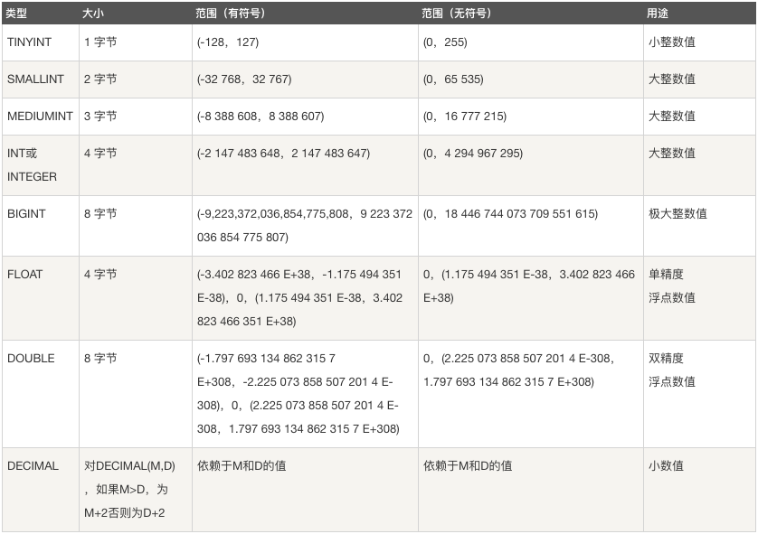

#### 日期和时间类型

表示时间值的日期和时间类型为DATETIME、DATE、TIMESTAMP、TIME和YEAR。

每个时间类型有一个有效值范围和一个"零"值，当指定不合法的MySQL不能表示的值时使用"零"值。
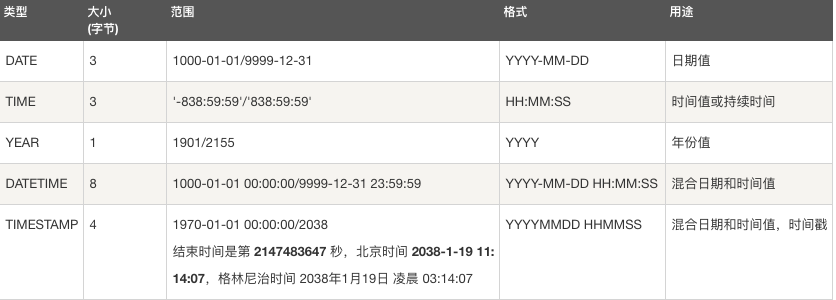

#### 字符串类型

字符串类型指CHAR、VARCHAR、BINARY、VARBINARY、BLOB、TEXT、ENUM和SET。该节描述了这些类型如何工作以及如何在查询中使用这些类型

CHAR 和 VARCHAR 类型类似，但它们保存和检索的方式不同。它们的最大长度和是否尾部空格被保留等方面也不同。在存储或检索过程中不进行大小写转换。

BINARY 和 VARBINARY 类似于 CHAR 和 VARCHAR，不同的是它们包含二进制字符串而不要非二进制字符串。也就是说，它们包含字节字符串而不是字符字符串。这说明它们没有字符集，并且排序和比较基于列值字节的数值值。

BLOB 是一个二进制大对象，可以容纳可变数量的数据。有 4 种 BLOB 类型：TINYBLOB、BLOB、MEDIUMBLOB 和 LONGBLOB。它们区别在于可容纳存储范围不同。

有 4 种 TEXT 类型：TINYTEXT、TEXT、MEDIUMTEXT 和 LONGTEXT。对应的这 4 种 BLOB 类型，可存储的最大长度不同，可根据实际情况选择。

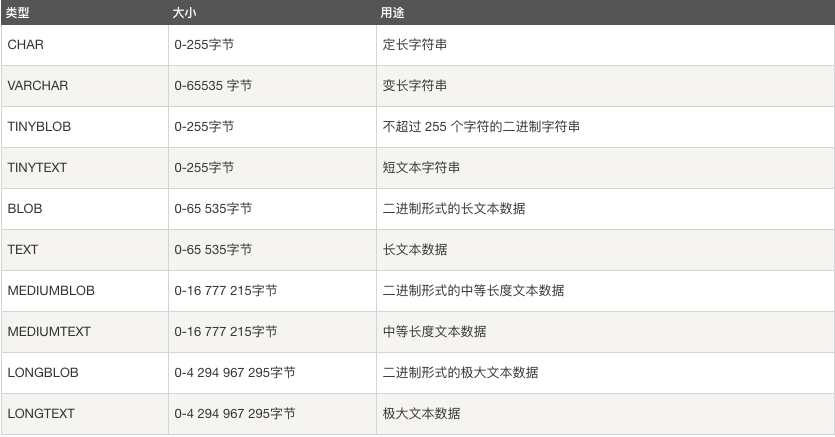

### 创建数据表

建MySQL数据表需要以下信息：
表名
表字段名
定义每个表字段

    CREATE TABLE table_name (column_name column_type);

     CREATE TABLE IF NOT EXISTS `root_tbl`(
      `root_id` INT UNSIGNED AUTO_INCREMENT,
      `root_title` VARCHAR(100) NOT NULL,
      `root_author` VARCHAR(40) NOT NULL,
      `submission_date` DATE,
       PRIMARY KEY ( `root_id` )
     )ENGINE=InnoDB DEFAULT CHARSET=utf8;

如果你不想字段为 NULL 可以设置字段的属性为 NOT NULL， 在操作数据库时如果输入该字段的数据为NULL ，就会报错。
AUTO_INCREMENT定义列为自增的属性，一般用于主键，数值会自动加1。
PRIMARY KEY关键字用于定义列为主键。 您可以使用多列来定义主键，列间以逗号分隔。
ENGINE 设置存储引擎，CHARSET 设置编码。     

##### MySQL 字段属性应该尽量设置为 NOT NULL
除非你有一个很特别的原因去使用 NULL 值，你应该总是让你的字段保持 NOT NULL。这看起来好像有点争议，请往下看。

1、首先，我们要搞清楚空值 "" 和 NULL 的概念：

 1）空值是不占用空间的
 2）MySQL中的NULL其实是占用空间的
所谓的 NULL 就是什么都没有，连 \0 都没有，\0 在字符串中是结束符，但是在物理内存是占空间的，等于一个字节，而 NULL 就是连这一个字节都没有。

2、其次，在数据库里是严格区分的，任何数跟 NULL 进行运算都是 NULL, 判断值是否等于 NULL，不能简单用 =，而要用 IS NULL关键字。

3、数据库的字段 col1 设为 NOT NULL, 仅仅说明该字段不能为 NULL, 也就是说只有在:

INSERT INTO table1(col1) VALUES(NULL);
这种情况下数据库会报错，而:

INSERT INTO table1(col1) VALUES('');
不会报错。

（如果字段是自增ID，第一句不会报错，这不能说明是可以为NULL,而是 数据库系统会根据ID设的缺省值填充，或者如果是自增字段就自动加一等缺省操作。）

4、含有空值的列很难进行查询优化，而且对表索引时不会存储 NULL 值的，所以如果索引的字段可以为 NULL，索引的效率会下降很多。因为它们使得索引、索引的统计信息以及比较运算更加复杂。你应该用 0、一个特殊的值或者一个空串代替空值。

5、联表查询的时候，例如 LEFT JOIN table2，若没有记录，则查找出的 table2 字段都是 null。假如 table2 有些字段本身可以是 null，那么除非把 table2 中 not null 的字段查出来，否则就难以区分到底是没有关联记录还是其他情况。

### 删除数据表

1、drop table table_name : 删除表全部数据和表结构，立刻释放磁盘空间，不管是 Innodb 和 MyISAM;

     DROP TABLE student;

2、truncate table table_name : 删除表全部数据，保留表结构，立刻释放磁盘空间 ，不管是 Innodb 和 MyISAM;

     TRUNCATE TABLE student;

3、delete from table_name : 删除表全部数据，表结构不变，对于 MyISAM 会立刻释放磁盘空间，InnoDB 不会释放磁盘空间;
 
      DELETE FROM student;

4、delete from table_name where xxx : 带条件的删除，表结构不变，不管是 innodb 还是 MyISAM 都不会释放磁盘空间;

     DELETE FROM student WHERE T_name = "张三";

5、delete 操作以后，使用 optimize table table_name 会立刻释放磁盘空间，不管是 innodb 还是 myisam;

    DELETE FROM student WHERE T_name = "张三";
    OPTIMIZE TABLE student;

6、delete from 表以后虽然未释放磁盘空间，但是下次插入数据的时候，仍然可以使用这部分空间。

### 插入数据

MySQL数据表插入数据通用的 INSERT INTO SQL语法

   
    INSERT INTO table_name ( field1, field2,...fieldN )
                       VALUES
                       ( value1, value2,...valueN );
    //Example                   
	INSERT INTO `user_relation` (
		`user_id`,
		`target_user_id`,
		`in_dtm`,
		`in_user`
	)
	VALUES
		(
		#{user_id},
		#{target_user_id},
		#{in_dtm},
		#{user_id}
		);                   

### 查询数据

MySQL数据库中查询数据通用的 SELECT 语法：

    SELECT column_name,column_name
	 FROM table_name
	[WHERE Clause]
	[LIMIT N][ OFFSET M]
 
 + SELECT * : 返回所有记录
 + LIMIT N : 返回 N 条记录
 + OFFSET M : 跳过 M 条记录, 默认 M=0, 单独使用似乎不起作用
 + LIMIT N,M : 相当于 LIMIT M OFFSET N , 从第 N 条记录开始, 返回 M 条记录

		   SELECT
				im.id
			FROM	
			im
			WHERE im.status = '1'
			AND im.type = 0

          SELECT * FROM table LIMIT 5,10
          
##### Example
/*websites  表名   NAME alexa url country  字段*/

	SELECT * FROM websites;                      /* 查询表所有数据 */
	
	SELECT NAME FROM websites;                   /* 查询表字段数据 */
	
	SELECT * FROM websites where name = "广西";   /* 查询表字段下条件数据 */
	
	SELECT * from websites where name like "_o%"; /* 模糊查询表下数据 */
	
	SELECT * FROM websites where id BETWEEN "1" AND "5";    /* 查询表下字段范围数据 */
	
	SELECT * FROM websites WHERE name in ("广西","百度");    /* 查询表字段下固定条件数据 */
	
	SELECT DISTINCT country FROM Websites;                  /* 查询去重值 */
	
	SELECT * FROM Websites WHERE country = "CN" AND alexa > 50;  /*查询表下范围条件数据*/
	
	SELECT * FROM Websites WHERE country = "USA" OR country="sh"; /* 查询表下条件不同值 */
	
	SELECT * FROM Websites ORDER BY alexa;                      /* 查询表下值排序结果 */
	
	SELECT * FROM Websites ORDER BY alexa DESC;                 /* 查询表下排序结果降序 */
	
	SELECT * FROM Websites LIMIT 2;      /* 查询表下范围数据 */
	
	SELECT name as zzz from websites;    /*别名查询表下数据*/

#### Join连接查询

 

####### 要理解各种JOIN首先要理解笛卡尔积。笛卡尔积就是将A表的每一条记录与B表的每一条记录强行拼在一起。所以，如果A表有n条记录，B表有m条记录，笛卡尔积产生的结果就会产生n*m条记录。下面的例子，t_blog有10条记录，t_type有5条记录，所有他们俩的笛卡尔积有50条记录。有五种产生笛卡尔积的方式如下。

+ 内连接：INNER JOIN

内连接INNER JOIN是最常用的连接操作。从数学的角度讲就是求两个表的交集，从笛卡尔积的角度讲就是从笛卡尔积中挑出ON子句条件成立的记录。有INNER JOIN，WHERE（等值连接），STRAIGHT_JOIN,JOIN(省略INNER)四种写法。至于哪种好我会在MySQL的JOIN（二）：优化讲述。示例如下。

	 SELECT * FROM t_blog INNER JOIN t_type ON t_blog.typeId=t_type.id;
	 SELECT * FROM t_blog,t_type WHERE t_blog.typeId=t_type.id;
	 SELECT * FROM t_blog STRAIGHT_JOIN t_type ON t_blog.typeId=t_type.id; --注意STRIGHT_JOIN有个下划线
	 SELECT * FROM t_blog JOIN t_type ON t_blog.typeId=t_type.id;
    +----+-------+--------+----+------+
    | id | title | typeId | id | name |
    +----+-------+--------+----+------+
    |  1 | aaa   |      1 |  1 | C++  |
    |  2 | bbb   |      2 |  2 | C    |
    |  7 | ggg   |      2 |  2 | C    |
    |  3 | ccc   |      3 |  3 | Java |
    |  6 | fff   |      3 |  3 | Java |
    |  4 | ddd   |      4 |  4 | C#   |
    |  5 | eee   |      4 |  4 | C#   |
    +----+-------+--------+----+------+

+ 左连接：LEFT JOIN
左连接LEFT JOIN的含义就是求两个表的交集外加左表剩下的数据。依旧从笛卡尔积的角度讲，就是先从笛卡尔积中挑出ON子句条件成立的记录，然后加上左表中剩余的记录（见最后三条）。

		SELECT * FROM t_blog LEFT JOIN t_type ON t_blog.typeId=t_type.id;
		+----+-------+--------+------+------+
		| id | title | typeId | id   | name |
		+----+-------+--------+------+------+
		|  1 | aaa   |      1 |    1 | C++  |
		|  2 | bbb   |      2 |    2 | C    |
		|  7 | ggg   |      2 |    2 | C    |
		|  3 | ccc   |      3 |    3 | Java |
		|  6 | fff   |      3 |    3 | Java |
		|  4 | ddd   |      4 |    4 | C#   |
		|  5 | eee   |      4 |    4 | C#   |
		|  8 | hhh   |   NULL | NULL | NULL |
		|  9 | iii   |   NULL | NULL | NULL |
		| 10 | jjj   |   NULL | NULL | NULL |
		+----+-------+--------+------+------+

+ 右连接：RIGHT JOIN

  同理右连接RIGHT JOIN就是求两个表的交集外加右表剩下的数据。再次从笛卡尔积的角度描述，右连接就是从笛卡尔积中挑出ON子句条件成立的记录，然后加上右表中剩余的记录（见最后一条）。  
  
 
	    SELECT * FROM t_blog RIGHT JOIN t_type ON t_blog.typeId=t_type.id;
	    +------+-------+--------+----+------------+
	    | id   | title | typeId | id | name       |
	    +------+-------+--------+----+------------+
	    |    1 | aaa   |      1 |  1 | C++        |
	    |    2 | bbb   |      2 |  2 | C          |
	    |    3 | ccc   |      3 |  3 | Java       |
	    |    4 | ddd   |      4 |  4 | C#         |
	    |    5 | eee   |      4 |  4 | C#         |
	    |    6 | fff   |      3 |  3 | Java       |
	    |    7 | ggg   |      2 |  2 | C          |
	    | NULL | NULL  |   NULL |  5 | Javascript |
	    +------+-------+--------+----+------------+ 
+ 外连接：OUTER JOIN

  外连接就是求两个集合的并集。从笛卡尔积的角度讲就是从笛卡尔积中挑出ON子句条件成立的记录，然后加上左表中剩余的记录，最后加上右表中剩余的记录。另外MySQL不支持OUTER JOIN，但是我们可以对左连接和右连接的结果做UNION操作来实现。
      
	    SELECT * FROM t_blog LEFT JOIN t_type ON t_blog.typeId=t_type.id
	    UNION
	    SELECT * FROM t_blog RIGHT JOIN t_type ON t_blog.typeId=t_type.id;
	    +------+-------+--------+------+------------+
	    | id   | title | typeId | id   | name       |
	    +------+-------+--------+------+------------+
	    |    1 | aaa   |      1 |    1 | C++        |
	    |    2 | bbb   |      2 |    2 | C          |
	    |    7 | ggg   |      2 |    2 | C          |
	    |    3 | ccc   |      3 |    3 | Java       |
	    |    6 | fff   |      3 |    3 | Java       |
	    |    4 | ddd   |      4 |    4 | C#         |
	    |    5 | eee   |      4 |    4 | C#         |
	    |    8 | hhh   |   NULL | NULL | NULL       |
	    |    9 | iii   |   NULL | NULL | NULL       |
	    |   10 | jjj   |   NULL | NULL | NULL       |
	    | NULL | NULL  |   NULL |    5 | Javascript |
	    +------+-------+--------+------+------------+

+ USING子句
  
  MySQL中连接SQL语句中，ON子句的语法格式为：table1.column_name = table2.column_name。当模式设计对联接表的列采用了相同的命名样式时，就可以使用 USING 语法来简化 ON 语法，格式为：USING(column_name)。 
所以，USING的功能相当于ON，区别在于USING指定一个属性名用于连接两个表，而ON指定一个条件。另外，SELECT *时，USING会去除USING指定的列，而ON不会。实例如下 

		SELECT * FROM t_blog INNER JOIN t_type ON t_blog.typeId =t_type.id;
		+----+-------+--------+----+------+
		| id | title | typeId | id | name |
		+----+-------+--------+----+------+
		|  1 | aaa   |      1 |  1 | C++  |
		|  2 | bbb   |      2 |  2 | C    |
		|  7 | ggg   |      2 |  2 | C    |
		|  3 | ccc   |      3 |  3 | Java |
		|  6 | fff   |      3 |  3 | Java |
		|  4 | ddd   |      4 |  4 | C#   |
		|  5 | eee   |      4 |  4 | C#   |
		+----+-------+--------+----+------+
		
		SELECT * FROM t_blog INNER JOIN t_type USING(id); -- 应为t_blog的typeId与t_type的id不同名，无法用Using，这里用id代替下。
	    +----+-------+--------+------------+
	    | id | title | id | name       |
	    +----+-------+--------+------------+
	    |  1 | aaa   |      1 | C++        |
	    |  2 | bbb   |      2 | C          |
	    |  3 | ccc   |      3 | Java       |
	    |  4 | ddd   |      4 | C#         |
	    |  5 | eee   |      4 | Javascript |
	    +----+-------+--------+------------+    
    
    
    
+ 自然连接：NATURE JOIN

  自然连接就是USING子句的简化版，它找出两个表中相同的列作为连接条件进行连接。有左自然连接，右自然连接和普通自然连接之分。在t_blog和t_type示例中，两个表相同的列是id，所以会拿id作为连接条件。 
另外千万分清下面三条语句的区别 。

  自然连接:SELECT * FROM t_blog NATURAL JOIN t_type; 
  
  笛卡尔积:SELECT * FROM t_blog NATURA JOIN t_type; 
  
  笛卡尔积:SELECT * FROM t_blog NATURE JOIN t_type;

		SELECT * FROM t_blog NATURAL JOIN t_type;
		SELECT t_blog.id,title,typeId,t_type.name FROM t_blog,t_type WHERE t_blog.id=t_type.id;
		SELECT t_blog.id,title,typeId,t_type.name FROM t_blog INNER JOIN t_type ON t_blog.id=t_type.id;
		 SELECT t_blog.id,title,typeId,t_type.name FROM t_blog INNER JOIN t_type USING(id);
	
	    +----+-------+--------+------------+
	    | id | title | typeId | name       |
	    +----+-------+--------+------------+
	    |  1 | aaa   |      1 | C++        |
	    |  2 | bbb   |      2 | C          |
	    |  3 | ccc   |      3 | Java       |
	    |  4 | ddd   |      4 | C#         |
	    |  5 | eee   |      4 | Javascript |
	    +----+-------+--------+------------+
	
	    SELECT * FROM t_blog NATURAL LEFT JOIN t_type;
	    SELECT t_blog.id,title,typeId,t_type.name FROM t_blog LEFT JOIN t_type ON t_blog.id=t_type.id;
	    SELECT t_blog.id,title,typeId,t_type.name FROM t_blog LEFT JOIN t_type USING(id);
	
	    +----+-------+--------+------------+
	    | id | title | typeId | name       |
	    +----+-------+--------+------------+
	    |  1 | aaa   |      1 | C++        |
	    |  2 | bbb   |      2 | C          |
	    |  3 | ccc   |      3 | Java       |
	    |  4 | ddd   |      4 | C#         |
	    |  5 | eee   |      4 | Javascript |
	    |  6 | fff   |      3 | NULL       |
	    |  7 | ggg   |      2 | NULL       |
	    |  8 | hhh   |   NULL | NULL       |
	    |  9 | iii   |   NULL | NULL       |
	    | 10 | jjj   |   NULL | NULL       |
	    +----+-------+--------+------------+
	
	    SELECT * FROM t_blog NATURAL RIGHT JOIN t_type;
	    SELECT t_blog.id,title,typeId,t_type.name FROM t_blog RIGHT JOIN t_type ON t_blog.id=t_type.id;
	    SELECT t_blog.id,title,typeId,t_type.name FROM t_blog RIGHT JOIN t_type USING(id);
	
	    +----+------------+-------+--------+
	    | id | name       | title | typeId |
	    +----+------------+-------+--------+
	    |  1 | C++        | aaa   |      1 |
	    |  2 | C          | bbb   |      2 |
	    |  3 | Java       | ccc   |      3 |
	    |  4 | C#         | ddd   |      4 |
	    |  5 | Javascript | eee   |      4 |
	    +----+------------+-------+--------+
### WHERE 子句	
		SELECT field1, field2,...fieldN FROM table_name1, table_name2...
		[WHERE condition1 [AND [OR]] condition2.....    
+ 查询语句中你可以使用一个或者多个表，表之间使用逗号, 分割，并使用WHERE语句来设定查询条件。
+ 可以在 WHERE 子句中指定任何条件。
+ 可以使用 AND 或者 OR 指定一个或多个条件。
+ WHERE 子句也可以运用于 SQL 的 DELETE 或者 UPDATE 命令。
+ WHERE 子句类似于程序语言中的 if 条件，根据 MySQL 表中的字段值来读取指定的数据。

以下为操作符列表，可用于 WHERE 子句中。

下表中实例假定 A 为 10, B 为 20	   
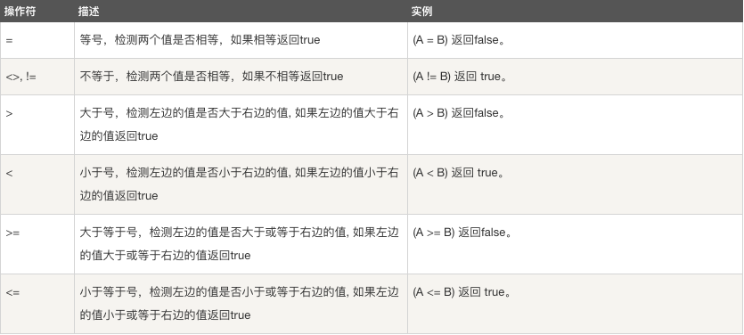

### UPDATE 更新
    UPDATE table_name SET field1=new-value1, field2=new-value2
    [WHERE Clause]

+ 可以同时更新一个或多个字段。
+ 可以在 WHERE 子句中指定任何条件。
+ 可以在一个单独表中同时更新数据。    

Example

		    UPDATE 
				topic
			SET 
				is_deleted = #{is_deleted}, 
				edit_dtm = #{edit_dtm}, 
				edit_user = #{edit_dtm}
			WHERE
				user_id = #{user_id} 
			AND topic_id = #{topic_id}
### LIKE 子句	

	SELECT field1, field2,...fieldN 
	FROM table_name
	WHERE field1 LIKE condition1 [AND [OR]] filed2 = 'somevalue'		
+ 可以在 WHERE 子句中指定任何条件。
+ 可以在 WHERE 子句中使用LIKE子句。
+ 可以使用LIKE子句代替等号 =。
+ LIKE 通常与 % 一同使用，类似于一个元字符的搜索。
+ 可以使用 AND 或者 OR 指定一个或多个条件。
+ 可以在 DELETE 或 UPDATE 命令中使用 WHERE...LIKE 子句来指定条件。

		'%a'     //以a结尾的数据
		'a%'     //以a开头的数据
		'%a%'    //含有a的数据
		'_a_'    //三位且中间字母是a的
		'_a'     //两位且结尾字母是a的
		'a_'     //两位且开头字母是a的		
		
		
		//查询以 java 字段开头的信息。
		SELECT * FROM position WHERE name LIKE 'java%';
		
		//查询包含 java 字段的信息。
		SELECT * FROM position WHERE name LIKE '%java%';
		
		//查询以 java 字段结尾的信息。
		SELECT * FROM position WHERE name LIKE '%java';

+ %：表示任意 0 个或多个字符。可匹配任意类型和长度的字符，有些情况下若是中文，请使用两个百分号（%%）表示。
+ _：表示任意单个字符。匹配单个任意字符，它常用来限制表达式的字符长度语句。
+ []：表示括号内所列字符中的一个（类似正则表达式）。指定一个字符、字符串或范围，要求所匹配对象为它们中的任一个。
+ [^] ：表示不在括号所列之内的单个字符。其取值和 [] 相同，但它要求所匹配对象为指定字符以外的任一个字符。
+ 查询内容包含通配符时,由于通配符的缘故，导致我们查询特殊字符 “%”、“_”、“[” 的语句无法正常实现，而把特殊字符用 “[ ]” 括起便可正常查询。

### UNION 操作符

	SELECT expression1, expression2, ... expression_n
	FROM tables
	[WHERE conditions]
	UNION [ALL | DISTINCT]
	SELECT expression1, expression2, ... expression_n
	FROM tables
	[WHERE conditions];
	
expression1, expression2, ... expression_n: 要检索的列。

tables: 要检索的数据表。

WHERE conditions: 可选， 检索条件。

DISTINCT: 可选，删除结果集中重复的数据。默认情况下 UNION 操作符已经删除了重复数据，所以 DISTINCT 修饰符对结果没啥影响。

ALL: 可选，返回所有结果集，包含重复数据。	

Example	

	(SELECT a.item_a FROM list a where a.status = 1 and a.item_b = #{id})
			UNION
	(SELECT b.item_b FROM list b where b.status = 1 and b.item_a = #{id} and b.bind_type = 1)
	
### 排序
MySQL 的 ORDER BY 子句来设定你想按哪个字段哪种方式来进行排序，再返回搜索结果

	SELECT field1, field2,...fieldN FROM table_name1, table_name2...
	ORDER BY field1 [ASC [DESC][默认 ASC]], [field2...] [ASC [DESC][默认 ASC]]

+ 可以使用任何字段来作为排序的条件，从而返回排序后的查询结果。
+ 可以设定多个字段来排序。
+ 可以使用 ASC 或 DESC 关键字来设置查询结果是按升序或降序排列。 默认情况下，它是按升序排列。
+ 可以添加 WHERE...LIKE 子句来设置条件。	

Example

	SELECT * from table ORDER BY date DESC	
### NULL 值处理
MySQL 使用 SQL SELECT 命令及 WHERE 子句来读取数据表中的数据,但是当提供的查询条件字段为 NULL 时，该命令可能就无法正常工作
关于 NULL 的条件比较运算是比较特殊的。你不能使用 = NULL 或 != NULL 在列中查找 NULL 值 。

在 MySQL 中，NULL 值与任何其它值的比较（即使是 NULL）永远返回 NULL，即 NULL = NULL 返回 NULL 。

MySQL 中处理 NULL 使用 IS NULL 和 IS NOT NULL 运算符	

+ IS NULL: 当列的值是 NULL,此运算符返回 true。
+ IS NOT NULL: 当列的值不为 NULL, 运算符返回 true。
+ <=>: 比较操作符（不同于 = 运算符），当比较的的两个值相等或者都为 NULL 时返回 true。	

		SELECT * FROM `table`  WHERE title IS NOT NULL LIMIT 0,1000
		SELECT * FROM `table`  WHERE date <=> NULL LIMIT 0,1000
		
### 正则表达式
MySQL可以通过 LIKE ...% 来进行模糊匹配
MySQL 同样也支持其他正则表达式的匹配， MySQL中使用 REGEXP 操作符来进行正则表达式匹配

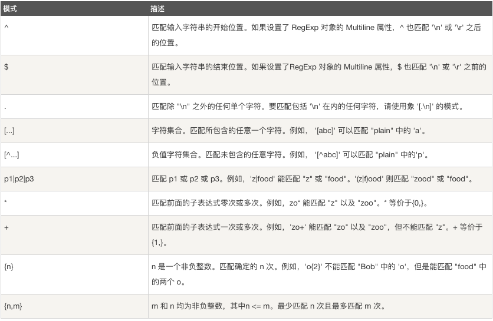

查找name字段中以'st'为开头的所有数据：

	SELECT name FROM person_tbl WHERE name REGEXP '^st';

查找name字段中以'ok'为结尾的所有数据：

	SELECT name FROM person_tbl WHERE name REGEXP 'ok$';

查找name字段中包含'mar'字符串的所有数据：

	SELECT name FROM person_tbl WHERE name REGEXP 'mar';

查找name字段中以元音字符开头或以'ok'字符串结尾的所有数据：

	SELECT name FROM person_tbl WHERE name REGEXP '^[aeiou]|ok$';		

### 事务	
MySQL 事务主要用于处理操作量大，复杂度高的数据。比如说，在人员管理系统中，你删除一个人员，你既需要删除人员的基本资料，也要删除和该人员相关的信息，如信箱，文章等等，这样，这些数据库操作语句就构成一个事务！

+ 在 MySQL 中只有使用了 Innodb 数据库引擎的数据库或表才支持事务。
+ 事务处理可以用来维护数据库的完整性，保证成批的 SQL 语句要么全部执行，要么全部不执行。
+ 事务用来管理 insert,update,delete 语句

一般来说，事务是必须满足4个条件（ACID）：：原子性（Atomicity，或称不可分割性）、一致性（Consistency）、隔离性（Isolation，又称独立性）、持久性（Durability）。

+ 原子性：一个事务（transaction）中的所有操作，要么全部完成，要么全部不完成，不会结束在中间某个环节。事务在执行过程中发生错误，会被回滚（Rollback）到事务开始前的状态，就像这个事务从来没有执行过一样。

+ 一致性：在事务开始之前和事务结束以后，数据库的完整性没有被破坏。这表示写入的资料必须完全符合所有的预设规则，这包含资料的精确度、串联性以及后续数据库可以自发性地完成预定的工作。

+ 隔离性：数据库允许多个并发事务同时对其数据进行读写和修改的能力，隔离性可以防止多个事务并发执行时由于交叉执行而导致数据的不一致。事务隔离分为不同级别，包括读未提交（Read uncommitted）、读提交（read committed）、可重复读（repeatable read）和串行化（Serializable）。

+ 持久性：事务处理结束后，对数据的修改就是永久的，即便系统故障也不会丢失。

###### 在 MySQL 命令行的默认设置下，事务都是自动提交的，即执行 SQL 语句后就会马上执行 COMMIT 操作。因此要显式地开启一个事务务须使用命令 BEGIN 或 START TRANSACTION，或者执行命令 SET AUTOCOMMIT=0，用来禁止使用当前会话的自动提交

##### 事务控制语句：
+ BEGIN 或 START TRANSACTION 显式地开启一个事务；

+ COMMIT 也可以使用 COMMIT WORK，不过二者是等价的。COMMIT 会提交事务，并使已对数据库进行的所有修改成为永久性的；

+ ROLLBACK 也可以使用 ROLLBACK WORK，不过二者是等价的。回滚会结束用户的事务，并撤销正在进行的所有未提交的修改；

+ SAVEPOINT identifier，SAVEPOINT 允许在事务中创建一个保存点，一个事务中可以有多个 SAVEPOINT；

+ RELEASE SAVEPOINT identifier 删除一个事务的保存点，当没有指定的保存点时，执行该语句会抛出一个异常；

+ ROLLBACK TO identifier 把事务回滚到标记点；

+ SET TRANSACTION 用来设置事务的隔离级别。InnoDB 存储引擎提供事务的隔离级别有READ UNCOMMITTED、READ COMMITTED、REPEATABLE READ 和 SERIALIZABLE。

##### MYSQL 事务处理主要有两种方法：

1、用 BEGIN, ROLLBACK, COMMIT来实现

+ BEGIN 开始一个事务
+ ROLLBACK 事务回滚
+ COMMIT 事务确认
2、直接用 SET 来改变 MySQL 的自动提交模式:

+ SET AUTOCOMMIT=0 禁止自动提交
+ SET AUTOCOMMIT=1 开启自动提交

### ALTER命令
当我们需要修改数据表名或者修改数据表字段时，就需要使用到MySQL ALTER命令。

##### 删除，添加或修改表字段
如下命令使用了 ALTER 命令及 DROP 子句来删除以上创建表的 i 字段：

    ALTER TABLE tab  DROP i;

如果数据表中只剩余一个字段则无法使用DROP来删除字段。

MySQL 中使用 ADD 子句来向数据表中添加列，如下实例在表 table 中添加 i 字段，并定义数据类型:

	ALTER TABLE table ADD i INT;
	
如果你需要指定新增字段的位置，可以使用MySQL提供的关键字 FIRST (设定位第一列)， AFTER 字段名（设定位于某个字段之后）。

	ALTER TABLE testalter_tbl DROP i;
	ALTER TABLE testalter_tbl ADD i INT FIRST;
	ALTER TABLE testalter_tbl DROP i;
	ALTER TABLE testalter_tbl ADD i INT AFTER c;
	
##### 修改字段类型及名称

如果需要修改字段类型及名称, 你可以在ALTER命令中使用 MODIFY 或 CHANGE 子句 。

例如，把字段 c 的类型从 CHAR(1) 改为 CHAR(10)，可以执行以下命令:

	ALTER TABLE table MODIFY c CHAR(10);
	
使用 CHANGE 子句, 语法有很大的不同。 在 CHANGE 关键字之后，紧跟着的是你要修改的字段名，然后指定新字段名及类型。尝试如下实例：

	ALTER TABLE table CHANGE i j BIGINT;
	ALTER TABLE table CHANGE j j INT;
	
##### ALTER TABLE 对 Null 值和默认值的影响

当你修改字段时，你可以指定是否包含值或者是否设置默认值。

以下实例，指定字段 j 为 NOT NULL 且默认值为100 

    ALTER TABLE table  MODIFY j BIGINT NOT NULL DEFAULT 100;
    
##### 修改字段默认值
   可以使用 ALTER 来修改字段的默认值
   
    ALTER TABLE table ALTER i SET DEFAULT 1000
    
#### 修改表名
如果需要修改数据表的名称，可以在 ALTER TABLE 语句中使用 RENAME 子句来实现。

尝试以下实例将数据表 table 重命名为 user_table：

    ALTER TABLE table RENAME TO user_table;
    
### 索引 
MySQL索引的建立对于MySQL的高效运行是很重要的，索引可以大大提高MySQL的检索速度。

+ 创建索引时，你需要确保该索引是应用在 SQL 查询语句的条件(一般作为 WHERE 子句的条件)。

+ 实际上，索引也是一张表，该表保存了主键与索引字段，并指向实体表的记录。

+ 上面都在说使用索引的好处，但过多的使用索引将会造成滥用。因此索引也会有它的缺点：虽然索引大大提高了查询速度，同时却会降低更新表的速度，如对表进行INSERT、UPDATE和DELETE。因为更新表时，MySQL不仅要保存数据，还要保存一下索引文件。

+ 建立索引会占用磁盘空间的索引文件   

#### 普通索引
##### 创建索引
这是最基本的索引，它没有任何限制。它有以下几种创建方式：

	CREATE INDEX indexName ON mytable(username(length)); 

如果是CHAR，VARCHAR类型，length可以小于字段实际长度；如果是BLOB和TEXT类型，必须指定 length。

修改表结构(添加索引)

	ALTER table tableName ADD INDEX indexName(columnName)

创建表的时候直接指定

	CREATE TABLE mytable(  
	 
	ID INT NOT NULL,   
	 
	username VARCHAR(16) NOT NULL,  
	 
	INDEX [indexName] (username(length))  
	 
	);  
删除索引的语法

	DROP INDEX [indexName] ON mytable; 	

#### 唯一索引
它与前面的普通索引类似，不同的就是：索引列的值必须唯一，但允许有空值。如果是组合索引，则列值的组合必须唯一。它有以下几种创建方式：

创建索引

    CREATE UNIQUE INDEX indexName ON mytable(username(length)) 

修改表结构

	ALTER table mytable ADD UNIQUE [indexName] (username(length))

创建表的时候直接指定
	CREATE TABLE mytable(  
	 
	ID INT NOT NULL,   
	 
	username VARCHAR(16) NOT NULL,  
	 
	UNIQUE [indexName] (username(length))  
	 
	);  	
	
#### 使用ALTER 命令添加和删除索引

有四种方式来添加数据表的索引：

+ ALTER TABLE tbl_name ADD PRIMARY KEY (column_list): 该语句添加一个主键，这意味着索引值必须是唯一的，且不能为NULL。
+ ALTER TABLE tbl_name ADD UNIQUE index_name (column_list): 这条语句创建索引的值必须是唯一的（除了NULL外，NULL可能会出现多次）。
+ ALTER TABLE tbl_name ADD INDEX index_name (column_list): 添加普通索引，索引值可出现多次。
+ ALTER TABLE tbl_name ADD FULLTEXT index_name (column_list):该语句指定了索引为 FULLTEXT ，用于全文索引。

		ALTER TABLE testalter_tbl ADD INDEX (c);
		ALTER TABLE testalter_tbl DROP INDEX c;

使用 ALTER 命令添加和删除主键

主键只能作用于一个列上，添加主键索引时，你需要确保该主键默认不为空（NOT NULL）。实例如下：

	ALTER TABLE testalter_tbl MODIFY i INT NOT NULL;
	ALTER TABLE testalter_tbl ADD PRIMARY KEY (i);		
你也可以使用 ALTER 命令删除主键：

	ALTER TABLE testalter_tbl DROP PRIMARY KEY;	
显示索引信息
   
    SHOW INDEX FROM table_name; \G	
    
    
### 元数据
+ 查询结果信息： SELECT, UPDATE 或 DELETE语句影响的记录数。
+ 数据库和数据表的信息： 包含了数据库及数据表的结构信息。
+ MySQL服务器信息： 包含了数据库服务器的当前状态，版本号等  

获取服务器元数据

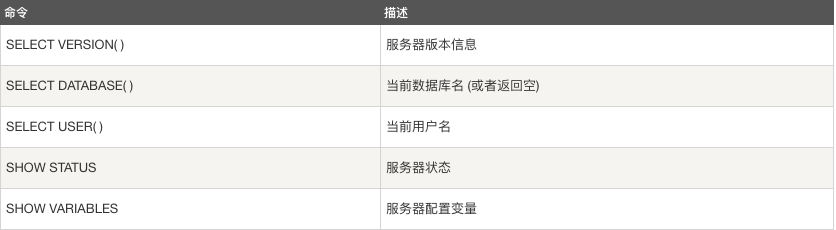

### 序列使用
MySQL 序列是一组整数：1, 2, 3, ...，由于一张数据表只能有一个字段自增主键， 如果你想实现其他字段也实现自动增加，就可以使用MySQL序列来实现

使用 AUTO_INCREMENT
MySQL 中最简单使用序列的方法就是使用 MySQL AUTO_INCREMENT 来定义列。

	CREATE TABLE insect
	     (id INT UNSIGNED NOT NULL AUTO_INCREMENT,
	     PRIMARY KEY (id),
	     name VARCHAR(30) NOT NULL, # type of insect
	     date DATE NOT NULL, # date collected
	     origin VARCHAR(30) NOT NULL # where collected
	);  
	
重置序列
	
如果你删除了数据表中的多条记录，并希望对剩下数据的AUTO_INCREMENT列进行重新排列，那么你可以通过删除自增的列，然后重新添加来实现。 不过该操作要非常小心，如果在删除的同时又有新记录添加，有可能会出现数据混乱。操作如下所示：

	ALTER TABLE insect DROP id;
	ALTER TABLE insect ADD id INT UNSIGNED NOT NULL AUTO_INCREMENT FIRST, ADD PRIMARY KEY (id);

设置序列的开始值

	CREATE TABLE insect
	     (
	    id INT UNSIGNED NOT NULL AUTO_INCREMENT,
	    PRIMARY KEY (id),
	    name VARCHAR(30) NOT NULL, 
	    date DATE NOT NULL,
	    origin VARCHAR(30) NOT NULL
	)engine=innodb auto_increment=100 charset=utf8;

或者你也可以在表创建成功后，通过以下语句来实现：

	ALTER TABLE t AUTO_INCREMENT = 100;
	
### 处理重复数据	

有些 MySQL 数据表中可能存在重复的记录，有些情况我们允许重复数据的存在，但有时候我们也需要删除这些重复的数据。

防止表中出现重复数据

+ 可以在 MySQL 数据表中设置指定的字段为 PRIMARY KEY（主键） 或者 UNIQUE（唯一） 索引来保证数据的唯一性

让我们尝试一个实例：下表中无索引及主键，所以该表允许出现多条重复记录。

	CREATE TABLE person_tbl
	(
	    first_name CHAR(20),
	    last_name CHAR(20),
	    sex CHAR(10)
	);
	
如果你想设置表中字段 first_name，last_name 数据不能重复，你可以设置双主键模式来设置数据的唯一性， 如果你设置了双主键，那么那个键的默认值不能为 NULL，可设置为 NOT NULL。如下所示：	

	CREATE TABLE person_tbl
	(
	   first_name CHAR(20) NOT NULL,
	   last_name CHAR(20) NOT NULL,
	   sex CHAR(10),
	   PRIMARY KEY (last_name, first_name)
	);
	
	
如果我们设置了唯一索引，那么在插入重复数据时，SQL 语句将无法执行成功,并抛出错。

INSERT IGNORE INTO 与 INSERT INTO 的区别就是 INSERT IGNORE 会忽略数据库中已经存在的数据，如果数据库没有数据，就插入新的数据，如果有数据的话就跳过这条数据。这样就可以保留数据库中已经存在数据，达到在间隙中插入数据的目的。

以下实例使用了 INSERT IGNORE INTO，执行后不会出错，也不会向数据表中插入重复数据：	

	INSERT IGNORE INTO person_tbl (last_name, first_name) VALUES( 'Jay', 'Thomas');
	
	INSERT IGNORE INTO person_tbl (last_name, first_name) VALUES( 'Jay', 'Thomas');

NSERT IGNORE INTO 当插入数据时，在设置了记录的唯一性后，如果插入重复数据，将不返回错误，只以警告形式返回。 而 REPLACE INTO 如果存在 primary 或 unique 相同的记录，则先删除掉。再插入新记录。

另一种设置数据的唯一性方法是添加一个 UNIQUE 索引，如下所示

	CREATE TABLE person_tbl
	(
	   first_name CHAR(20) NOT NULL,
	   last_name CHAR(20) NOT NULL,
	   sex CHAR(10),
	   UNIQUE (last_name, first_name)
	);
	
##### 统计重复数据
以下我们将统计表中 first_name 和 last_name的重复记录数：

	SELECT COUNT(*) as repetitions, last_name, first_name FROM person_tbl GROUP BY last_name, first_name HAVING repetitions > 1;

以上查询语句将返回 person_tbl 表中重复的记录数。 一般情况下，查询重复的值，请执行以下操作：

+ 确定哪一列包含的值可能会重复。
+ 在列选择列表使用COUNT(*)列出的那些列。
+ 在GROUP BY子句中列出的列。
+ HAVING子句设置重复数大于1。

#### 过滤重复数据

如果你需要读取不重复的数据可以在 SELECT 语句中使用 DISTINCT 关键字来过滤重复数据。

	SELECT DISTINCT last_name, first_name FROM person_tbl;
	
你也可以使用 GROUP BY 来读取数据表中不重复的数据：

	SELECT last_name, first_name FROM person_tbl GROUP BY (last_name, first_name);

##### 删除重复数据
如果你想删除数据表中的重复数据，你可以使用以下的SQL语句：

	CREATE TABLE tmp SELECT last_name, first_name, sex FROM person_tbl  GROUP BY (last_name, first_name, sex);
	DROP TABLE person_tbl;
	ALTER TABLE tmp RENAME TO person_tbl;
	
当然你也可以在数据表中添加 INDEX（索引） 和 PRIMAY KEY（主键）这种简单的方法来删除表中的重复记录。方法如下：

	ALTER IGNORE TABLE person_tbl ADD PRIMARY KEY (last_name, first_name);
	
### SQL 注入
所谓SQL注入，就是通过把SQL命令插入到Web表单递交或输入域名或页面请求的查询字符串，最终达到欺骗服务器执行恶意的SQL命令

防止SQL注入，我们需要注意以下几个要点：

1. 永远不要信任用户的输入。对用户的输入进行校验，可以通过正则表达式，或限制长度；对单引号和 双"-"进行转换等。
2. 永远不要使用动态拼装sql，可以使用参数化的sql或者直接使用存储过程进行数据查询存取。
3. 永远不要使用管理员权限的数据库连接，为每个应用使用单独的权限有限的数据库连接。
4. 不要把机密信息直接存放，加密或者hash掉密码和敏感的信息。
5. 应用的异常信息应该给出尽可能少的提示，最好使用自定义的错误信息对原始错误信息进行包装
6. sql注入的检测方法一般采取辅助软件或网站平台来检测，软件一般采用sql注入检测工具jsky，网站平台就有亿思网站安全平台检测工具。MDCSOFT SCAN等。采用MDCSOFT-IPS可以有效的防御SQL注入，XSS攻击等。

### 函数
##### 字符串函数
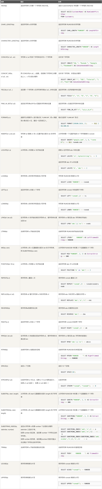

##### 数字函数
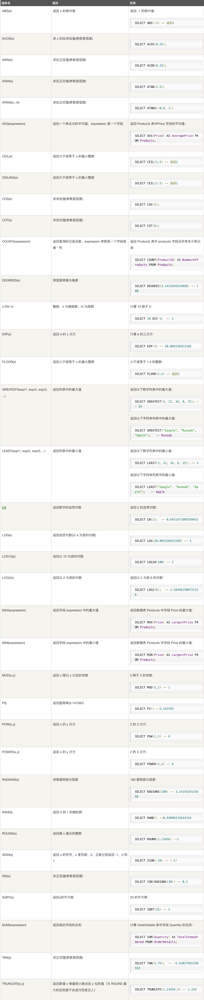

##### 日期函数
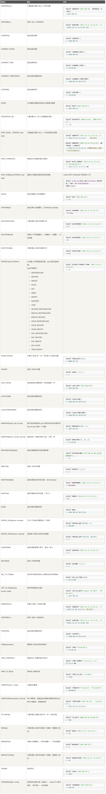

##### 高级函数
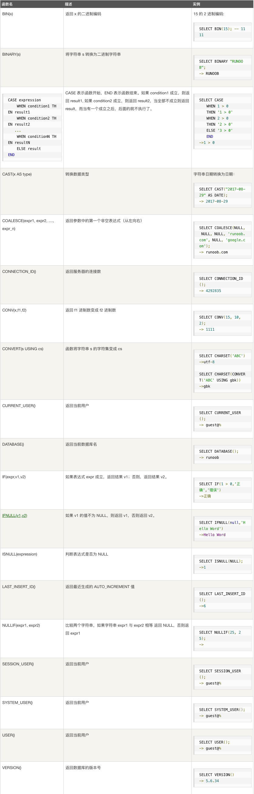

### 运算符
##### 算术运算符

MySQL 支持的算术运算符包括:

  运算符	  作用

 + +	      加法
 + -	      减法
 + *	      乘法
 + / 或 DIV	除法
 + % 或 MOD	取余

在除法运算和模运算中，如果除数为0，将是非法除数，返回结果为NULL。

1. 加

		select 1+2;
		+-----+
		| 1+2 |
		+-----+
		|   3 |
		+-----+

2. 减

		select 1-2;
		+-----+
		| 1-2 |
		+-----+
		|  -1 |
		+-----+

3. 乘

		select 2*3;
		+-----+
		| 2*3 |
		+-----+
		|   6 |
		+-----+
		
4. 乘

		select 2/3;
		+--------+
		| 2/3    |
		+--------+
		| 0.6667 |
		+--------+	
		
5. 商

		select 10 DIV 4;
		+----------+
		| 10 DIV 4 |
		+----------+
		|        2 |
		+----------+			
		
6. 商

		select 10 MOD 4;
		+----------+
		| 10 MOD 4 |
		+----------+
		|        2 |
		+----------+	
		
##### 比较运算符

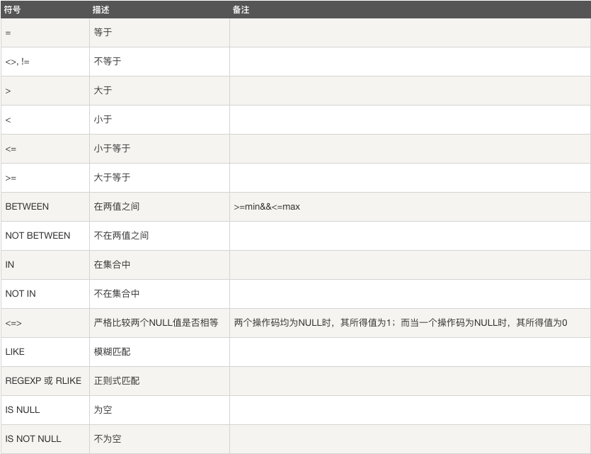

1. 等于

		mysql> select 2=3;
		+-----+
		| 2=3 |
		+-----+
		|   0 |
		+-----+
		
		
		mysql> select NULL = NULL;
		+-------------+
		| NULL = NULL |
		+-------------+
		|        NULL |
		+-------------+	
		
		
2. 不等于

		mysql> select 2<>3;
		+------+
		| 2<>3 |
		+------+
		|    1 |
		+------+
		
		
3. 不等于

与 = 的区别在于当两个操作码均为 NULL 时，其所得值为 1 而不为 NULL，而当一个操作码为 NULL 时，其所得值为 0而不为 NULL。

		mysql> select 2<=>3;
		+-------+
		| 2<=>3 |
		+-------+
		|     0 |
		+-------+
		
		
		mysql> select null=null;
		+-----------+
		| null=null |
		+-----------+
		|      NULL |
		+-----------+
		
		        
		mysql> select null<=>null;
		+-------------+
		| null<=>null |
		+-------------+
		|           1 |
		+-------------+
		
4、小于

		mysql> select 2<3;
		+-----+
		| 2<3 |
		+-----+
		|   1 |
		+-----+
		
5、小于等于

	mysql> select 2<=3;
	+------+
	| 2<=3 |
	+------+
	|    1 |
	+------+
	
6、大于

	mysql> select 2>3;
	+-----+
	| 2>3 |
	+-----+
	|   0 |
	+-----+

7、大于等于

	mysql> select 2>=3;
	+------+
	| 2>=3 |
	+------+
	|    0 |
	+------+
	
8、BETWEEN

	mysql> select 5 between 1 and 10;
	+--------------------+
	| 5 between 1 and 10 |
	+--------------------+
	|                  1 |
	+--------------------+
	
9、IN

	mysql> select 5 in (1,2,3,4,5);
	+------------------+
	| 5 in (1,2,3,4,5) |
	+------------------+
	|                1 |
	+------------------+	
	
10、NOT IN

	mysql> select 5 not in (1,2,3,4,5);
	+----------------------+
	| 5 not in (1,2,3,4,5) |
	+----------------------+
	|                    0 |
	+----------------------+	
	
11、IS NULL

	mysql> select null is NULL;
	+--------------+
	| null is NULL |
	+--------------+
	|            1 |
	+--------------+
	
	mysql> select 'a' is NULL;
	+-------------+
	| 'a' is NULL |
	+-------------+
	|           0 |
	+-------------+	
	
12、IS NOT NULL

	mysql> select null IS NOT NULL;
	+------------------+
	| null IS NOT NULL |
	+------------------+
	|                0 |
	+------------------+
	
	        
	mysql> select 'a' IS NOT NULL;
	+-----------------+
	| 'a' IS NOT NULL |
	+-----------------+
	|               1 |
	+-----------------+	
	
13、LIKE

	mysql> select '12345' like '12%';
	+--------------------+
	| '12345' like '12%' |
	+--------------------+
	|                  1 |
	+--------------------+
	
	mysql> select '12345' like '12_';
	+--------------------+
	| '12345' like '12_' |
	+--------------------+
	|                  0 |
	+--------------------+
	
14、REGEXP

	mysql> select 'beijing' REGEXP 'jing';
	+-------------------------+
	| 'beijing' REGEXP 'jing' |
	+-------------------------+
	|                       1 |
	+-------------------------+
	
	mysql> select 'beijing' REGEXP 'xi';
	+-----------------------+
	| 'beijing' REGEXP 'xi' |
	+-----------------------+
	|                     0 |
	+-----------------------+	
	

##### 逻辑运算符
逻辑运算符用来判断表达式的真假。如果表达式是真，结果返回 1。如果表达式是假，结果返回 0。

  
+ NOT 或 !	逻辑非
+ AND	逻辑与
+ OR	逻辑或
+ XOR	逻辑异或
	
1. 与

		mysql> select 2 and 0;
		+---------+
		| 2 and 0 |
		+---------+
		|       0 |
		+---------+
			
		        
		mysql> select 2 and 1;   
		+---------+     
		| 2 and 1 |      
		+---------+      
		|       1 |      
		+---------+
		
2. 或
		
		mysql> select 2 or 0;
		+--------+
		| 2 or 0 |
		+--------+
		|      1 |
		+--------+
		
		mysql> select 2 or 1;
		+--------+
		| 2 or 1 |
		+--------+
		|      1 |
		+--------+
		
		mysql> select 0 or 0;
		+--------+
		| 0 or 0 |
		+--------+
		|      0 |
		+--------+
		
		mysql> select 1 || 0;
		+--------+
		| 1 || 0 |
		+--------+
		|      1 |
		+--------+

3. 非
	
		mysql> select not 1;
		+-------+
		| not 1 |
		+-------+
		|     0 |
		+-------+
		
		mysql> select !0;
		+----+
		| !0 |
		+----+
		|  1 |
		+----+

4、异或

	mysql> select 1 xor 1;
	+---------+
	| 1 xor 1 |
	+---------+
	|       0 |
	+---------+
	
	mysql> select 0 xor 0;
	+---------+
	| 0 xor 0 |
	+---------+
	|       0 |
	+---------+
	
	mysql> select 1 xor 0;
	+---------+
	| 1 xor 0 |
	+---------+
	|       1 |
	+---------+
	
	mysql> select null or 1;
	+-----------+
	| null or 1 |
	+-----------+
	|         1 |
	+-----------+
	
	mysql> select 1 ^ 0;
	+-------+
	| 1 ^ 0 |
	+-------+
	|     1 |
	+-------+	
	
	
##### 位运算符

位运算符是在二进制数上进行计算的运算符。位运算会先将操作数变成二进制数，进行位运算。然后再将计算结果从二进制数变回十进制数。

+ &	按位与
+ |	按位或
+ ^	按位异或
+ !	取反
+ <<	左移
+ \>>	右移

1. 按位与
 
 
		mysql> select 3&5;
		+-----+
		| 3&5 |
		+-----+
		|   1 |
		+-----+

2. 按位或

		mysql> select 3|5;
		+-----+
		| 3|5 |
		+-----+
		|   7 |
		+-----+

3. 按位异或

		mysql> select 3^5;
		+-----+
		| 3^5 |
		+-----+
		|   6 |
		+-----+

4. 按位取反

		mysql> select ~18446744073709551612;
		+-----------------------+
		| ~18446744073709551612 |
		+-----------------------+
		|                     3 |
		+-----------------------+

5. 按位右移

		mysql> select 3>>1;
		+------+
		| 3>>1 |
		+------+
		|    1 |
		+------+

6. 按位左移

		mysql> select 3<<1;
		+------+
		| 3<<1 |
		+------+
		|    6 |
		+------+
		
##### 运算符优先级

+ 最低优先级为： :=。

+ 最高优先级为： !、BINARY、 COLLATE。

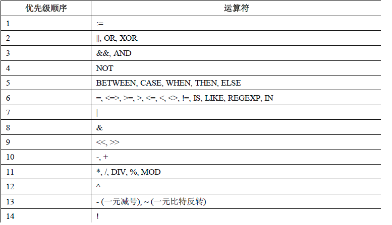

### count()函数
+ count()函数是用来统计表中记录的一个函数，返回匹配条件的行数。

##### count()语法：

+ count(*)---包括所有列，返回表中的记录数，相当于统计表的行数，在统计结果的时候，不会忽略列值为NULL的记录。

+ count(1)---忽略所有列，1表示一个固定值，也可以用count(2)、count(3)代替，在统计结果的时候，不会忽略列值为NULL的记录。

+ count(列名)---只包括列名指定列，返回指定列的记录数，在统计结果的时候，会忽略列值为NULL的记录（不包括空字符串和0），即列值为NULL的记录不统计在内。

+ count(distinct 列名)---只包括列名指定列，返回指定列的不同值的记录数，在统计结果的时候，在统计结果的时候，会忽略列值为NULL的记录（不包括空字符串和0），即列值为NULL的记录不统计在内。

##### count(*)&count(1)&count(列名)执行效率比较：

（1）如果列为主键，count(列名)效率优于count(1)

（2）如果列不为主键，count(1)效率优于count(列名)

（3）如果表中存在主键，count(主键列名)效率最优

（4）如果表中只有一列，则count(*)效率最优

（5）如果表有多列，且不存在主键，则count(1)效率优于count(*)

因为count(*)和count(1)统计过程中不会忽略列值为NULL的记录，所以可以通过以下两种方式来统计列值为NULL的记录数:

	select count(*) from table where is_active is null;
	select count(1) from table where is_active is null;
	
特例

	select count('') from table;-返回表的记录数
	select count(0) from table;-返回表的记录数
	select count(null) from table;-返回0