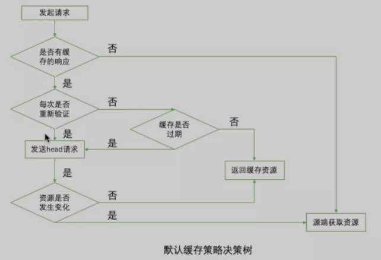
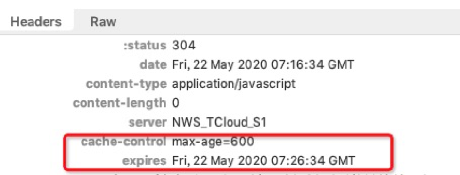

### WKWebview使用攻略

###### iOS8.0之后我们可以使用WebKit框架中的WKWebView来加载网页，WKWebView可将网页处理限制在App的网页视图中，从而确保不安全的网站内容不会影响到App的其他部分，并且苹果表示2020年12月起将不再接受使用UIWebView的App更新，因此我对WKWebView的使用方法及在使用WKWebView的过程中遇到的问题进行了总结。

###### 首先WKWebView的优点很多了，内存开销比UIWebView小很多，支持了更多的HTML5特性，流程粒度上更加细致，可以在请求时候询问是否请求数据还可以在返回数据后询问是否加载数据，在返回错误时候也更加细致。

#### WKWebView的创建

	- (WKWebView *)webView {
	    if (_webView) {
	        return _webView;
	    }
	    WKUserContentController *userContentController = [[WKUserContentController alloc] init];
	    [userContentController addScriptMessageHandler:[[WKWeakScriptMessageDelegate alloc] initWithDelegate:self] name:@"jsCallOC"];
	    WKWebViewConfiguration* webViewConfig = [[WKWebViewConfiguration alloc] init];
	    webViewConfig.userContentController = userContentController;
	    webViewConfig.processPool = [[self cookieManager] sharedProcessPool];
	    webViewConfig.allowsInlineMediaPlayback = true;
	    
	    _webView = [[WKWebView alloc] initWithFrame:CGRectMake(0,
	                                                           CGRectGetHeight(self.iTopBar.frame),
	                                                           self.view.bounds.size.width,
	                                                           (self.view.bounds.size.height - CGRectGetHeight(self.iTopBar.frame))) configuration:webViewConfig];
	    _webView.backgroundColor = [UIColor whiteColor];
	    _webView.scrollView.backgroundColor = [UIColor blackColor];
	    _webView.opaque = NO;
	    _webView.scrollView.showsHorizontalScrollIndicator = NO;
	    _webView.scrollView.showsVerticalScrollIndicator = NO;
	
	    _webView.opaque = NO;
	    _webView.autoresizingMask = UIViewAutoresizingFlexibleHeight | UIViewAutoresizingFlexibleWidth;
	    _webView.scrollView.bounces = !self.disableBounces;
	    _webView.UIDelegate = self;
	    _webView.navigationDelegate = self;
	    return _webView;
	}
	
其中：

+ WKWebViewConfiguration 用来添加WKWebView的一些配置信息，包括交互的userContentController，进程池processPool及一些其他的属性
+ WKUserContentController 这个类主要用处理JavaScript向webview发送消息的交互，addScriptMessageHandler方法注册了一个名为jsCallOC的方法用来和H5进行交互，具体的交互的方法名可以两端统一即可
+ webViewConfig.allowsInlineMediaPlayback = YES;这个属性是支持视频页面内播放，这里注意下，不设置这个属性会导致页面内的视频都是打开视频播放器全屏播放的，使用UIWebview时候没有这个问题，所以提醒大家在使用WKWebview时候注意一下

#### WKWebview的主要代理方法

WKNavigationDelegate主要是处理一些跳转、加载处理操作，WKUIDelegate主要处理JS脚本，确认框，警告框等。

WKNavigationDelegate常用代理方法：

	/** 开始请求服务器并加载页面 */
	- (void)webView:(WKWebView *)webView didStartProvisionalNavigation:(null_unspecified WKNavigation *)navigation;
	/** 开始渲染页面时调用，响应的内容到达主页面的时候响应,刚准备开始渲染页面*/
	- (void)webView:(WKWebView *)webView didCommitNavigation:(WKNavigation *)navigation;
	/** 页面渲染完成后调用 */
	- (void)webView:(WKWebView *)webView didFinishNavigation:(null_unspecified WKNavigation *)navigation;
	/** 页面加载出错调用 */
	- (void)webView:(WKWebView *)webView didFailNavigation:(null_unspecified WKNavigation *)navigation withError:(NSError *)error;
	/** 请求服务器发生错误 (如果是goBack时，当前页面也会回调这个方法，原因是NSURLErrorCancelled取消加载) */
	- (void)webView:(WKWebView *)webView didFailProvisionalNavigation:(WKNavigation *)navigation withError:(NSError *)error;
	/** 是否允许页面加载 */
	- (void)webView:(WKWebView *)webView decidePolicyForNavigationAction:(WKNavigationAction *)navigationAction decisionHandler:(void (^)(WKNavigationActionPolicy))decisionHandler;
	/** 接收到服务器跳转请求即服务重定向时之后调用 */
	- (void)webView:(WKWebView *)webView didReceiveServerRedirectForProvisionalNavigation:(WKNavigation *)navigation;
	/** 收到服务器响应后，决定是否跳转 */
	- (void)webView:(WKWebView *)webView decidePolicyForNavigationResponse:(WKNavigationResponse *)navigationResponse decisionHandler:(void (^)(WKNavigationResponsePolicy))decisionHandler;	

	
其中decidePolicyForNavigationAction相当于uiwebview的shouldStartLoadWithRequest方法，在这个方法里可以对页面跳转进行拦截处理，decisionHandler(WKNavigationActionPolicyAllow)是允许跳转，decisionHandler(WKNavigationActionPolicyCancel)是取消跳转，注意当处理情况比较多时候执行完decisionHandler()这个回调后要加上return，否则会引起崩溃。

WKUIDelegate常用代理方法：

	/   *  web界面中有弹出警告框时调用
	     *
	     *  @param webView           实现该代理的webview
	     *  @param message           警告框中的内容
	     *  @param completionHandler 警告框消失调用
	     */
	- (void)webView:(WKWebView *)webView runJavaScriptAlertPanelWithMessage:(NSString *)message initiatedByFrame:(WKFrameInfo *)frame completionHandler:(void (^)(void))completionHandler;
	/** 输入框 */
	- (void)webView:(WKWebView *)webView runJavaScriptTextInputPanelWithPrompt:(NSString *)prompt defaultText:(nullable NSString *)defaultText initiatedByFrame:(WKFrameInfo *)frame completionHandler:(void (^)(NSString * _Nullable result))completionHandler;
	/** 确认框 */
	- (void)webView:(WKWebView *)webView runJavaScriptConfirmPanelWithMessage:(NSString *)message initiatedByFrame:(WKFrameInfo *)frame completionHandler:(void (^)(BOOL result))completionHandler;
	/** 创建一个新的webView,可以解决点击内部链接没有反应问题 */
	- (WKWebView *)webView:(WKWebView *)webView createWebViewWithConfiguration:(WKWebViewConfiguration *)configuration forNavigationAction:(WKNavigationAction *)navigationAction windowFeatures:(WKWindowFeatures *)windowFeatures;

这里注意下，在使用WKWebview时发现有些三方播放页面点击链接不跳转的问题，查阅相关资料后发现，用户点击网页上的链接，需要打开新页面时，将先调用decidePolicyForNavigationAction方法，其中的WKNavigationAction有两个属性sourceFrame和targetFrame，类型是WKFrameInfo，WKFrameInfo的mainFrame属性标记着这个frame是在主frame里还是新开一个frame。

如果 targetFrame的mainFrame属性为NO，将会新开一个页面，WKWebView遇到这种情况，将会调用它的 WKUIDelegate代理中的createWebViewWithConfiguration方法，所以如果我们不实现这个协议就会出现点击无反应的情况，因此对于这种情况需要特殊处理，可以采取下边的方法：

	-(WKWebView *)webView:(WKWebView *)webView createWebViewWithConfiguration:(WKWebViewConfiguration *)configuration forNavigationAction:(WKNavigationAction *)navigationAction windowFeatures:(WKWindowFeatures *)windowFeatures {
	    if (!navigationAction.targetFrame.isMainFrame) {
	        [webView loadRequest:navigationAction.request];
	    }
	    return nil;
	}
	
相当于放弃原来页面直接打开新的页面。

#### WKWebview注册UserAgent

	[webView evaluateJavaScript:@"navigator.userAgent" completionHandler:^(id obj, NSError *error) {
	 if([obj isKindOfClass:[NSString class]]){
	  NSString * userAgent = obj; 
	  if(![userAgent containsString:@"customUA"]){
	   userAgent = [userAgent stringByAppendingString:@"customUA"];
	  }
	  [[NSUserDefaults standardUserDefaults] registerDefaults:@{ @"UserAgent": userAgent OR @""}];
	     [[NSUserDefaults standardUserDefaults] setObject:userAgent forKey:uaKey];
	     self.webView.customUserAgent = userAgent;
	 }
	}];

对于iOS8系统使用下边方法

	[self.webView setValue: userAgent forKey:@"applicationNameForUserAgent"];

#### Cookie同步

因为WKWebview不会像UIWebview那样每次在请求之前会将NSHTTPCookieStorage里面的cookie自动添加到请求中，所以应采用将cookie通过js注入到WKWebview中的方法，我采用了https://www.jianshu.com/p/277c2141303d博客中提到的使用同一个processPool的方法，创建了两个WKWebView，其中的一个用来加载h5，另一个专门用来加载cookie，解决了WKWebview种cookie的问题。

由于UIWebview的Cookie是由NSHTTPCookieStorage管理的，NSHTTPCookieStorage是一个单例可以管理整个项目的Cookie，在请求时候会自动带上上次保存的Cookie，但是WKWebview的Cookie信息并不存储在NSHTTPCookieStorage中，是由WKProcessPool管理的，所以对于多个WKWebview之间可以通过将WKProcessPool单例化来解决Cookie共享的问题。

设置cookie可在第一次请求host时使用一个cookieWebview来加载并设置好cookie，然后再使用self.webview来继续加载url，self.webview与cookieWebview共用单例sharedProcessPool，因此可以解决WKWebview种cookie的问题。

为方便管理可以使用WKWebViewCookieManager来单独实现cookie的逻辑：

	- (void)setCookieWithUrl:(NSURL *)url {
	    NSString *host = [url host];
	    
	    if (!self.webviewCookie.length) {
	        [self requestWKWebviewCookie];
	        return;
	    }
	    
	    if ([self.cookieURLs containsObject:host]) {
	        return;
	    }
	    [self.cookieURLs addObject:host];
	    
	    WKUserScript *wkcookieScript = [[WKUserScript alloc] initWithSource:self.webviewCookie
	                                                          injectionTime:WKUserScriptInjectionTimeAtDocumentStart
	                                                       forMainFrameOnly:NO];
	    [self.cookieWebview.configuration.userContentController addUserScript:wkcookieScript];
	    
	    NSString *baseWebUrl = [NSString stringWithFormat:@"%@://%@", url.scheme, url.host];
	    [self.cookieWebview loadHTMLString:@"" baseURL:[NSURL URLWithString:baseWebUrl]];
	}

	- (WKWebView *)cookieWebview {
	    if (!_cookieWebview) {
	        WKUserContentController *userContentController = WKUserContentController.new;
	        WKWebViewConfiguration* webViewConfig = WKWebViewConfiguration.new;
	        webViewConfig.userContentController = userContentController;
	        webViewConfig.processPool = [self sharedProcessPool];
	        
	        _cookieWebview = [[WKWebView alloc] initWithFrame:CGRectZero configuration:webViewConfig];
	        _cookieWebview.UIDelegate = self;
	        _cookieWebview.navigationDelegate = self;
	    }
	    return _cookieWebview;
	}
	
	
#### Native与H5的交互

js与OC交互
js向OC传值的方法有两种，一种是通过拦截url，可以通过拦截url中的字段来进行处理，有些情况下通过url传参数比较方便，可以及时处理参数减少打开h5页面的延迟，但是需要视具体业务逻辑来处理，有的可能通过url传参数无法兼容老的版本或者有其他的问题，这种情况则可以使用另一种方法处理。

	- (void)webView:(WKWebView *)webView decidePolicyForNavigationAction:(WKNavigationAction *)navigationAction decisionHandler:(void (^)(WKNavigationActionPolicy))decisionHandler {
	    NSURL *url = navigationAction.request.URL;
	    if ([url.scheme isEqualToString:@"sv"]) {
	     //do something。。。
	     decisionHandler(WKNavigationActionPolicyAllow);
	      return;
	    }else{
	     //do other things。。。
	     decisionHandler(WKNavigationActionPolicyAllow);
	      return;
	    }
	}
另一种是使用WKScriptMessageHandler代理方法，通过和js约定好调用方法，在创建webview时候监听jsCallOC方法

	- (void)userContentController:(WKUserContentController *)userContentController
	      didReceiveScriptMessage:(WKScriptMessage *)message {
	    NSLog(@"[WebView] : H5对客户端发起调用 name : %@, body : %@", message.name, message.body);
	    
	    if([message.name isEqualToString:@"jsCallOC"] && [message.body isKindOfClass:[NSString class]]){
	    NSDictionary *result = [message.body JSONDictionary];
	    NSString *value = [result stringOrEmptyStringForKey:@"value"];//value为h5传过来的值
	    //do something。。。
	    }
	}	
	
	
js端调用方法为如下，注意传值时候的JSON格式处理，处理不正确会出现传值失败无法调用成功的问题

	window.webkit&&window.webkit.messageHandlers.jsCallOC.postMessage(JSON.stringify(data));
	
OC与js交互 OC调用js的方法就比较简单如下

	NSString * OCCallJs = [NSString stringWithFormat:@"OCCallJs('%@')", value];//注意调用js方法传参数要加上单引号！！！
	[self.webView evaluateJavaScript:OCCallJs completionHandler:^(id result, NSError *error) {
	  }];

#### 缓存策略

	typedef NS_ENUM(NSUInteger, NSURLRequestCachePolicy)
	{
	    NSURLRequestUseProtocolCachePolicy = 0, // 默认策略
	    NSURLRequestReloadIgnoringLocalCacheData = 1, // 忽略本地缓存，直接从后台请求数据
	    NSURLRequestReloadIgnoringLocalAndRemoteCacheData = 4, // 系统未实现，忽略本地缓存数据、代理和其他中介的缓存，直接从后台请求数据
	    NSURLRequestReturnCacheDataElseLoad = 2, // 只有在cache中不存在data时才从原始地址下载
	    NSURLRequestReturnCacheDataDontLoad = 3,  // 只从本地拿数据,如果不存在本地缓存，请求失败
	    NSURLRequestReloadRevalidatingCacheData = 5, // 验证本地数据与远程数据是否相同，如果不同则下载远程数据，否则使用本地数据
	};
	
	
	默认策略NSURLRequestUseProtocolCachePolicy：如果一个NSCachedURLResponse对于请求并不存在，则直接从源端取数据。如果请求拥有一个缓存的响应，那么URL加载系统会检查这个响应来决定，如内容必须重新验证的话，将建立一个连向源端的连接来查看内容是否发生变化。假如内容没有变化，那么响应就从本地缓存返回数据。如果内容变化了，那么数据将从源端获取。

对于缓存的响应过期或者需要重新验证的情况，可以通过HTTP中请求和响应头来判断：

1. Cache-Control
如响应头部包括的Cache-Control，服务器需要根据Cache-Control这个响应头来指定缓存策略，Cache-Control的选项中no-store的优先级最高，其他值可以相互组合，public表示响应可被任何缓存区缓存；private内容仅客户端可以缓存；no-cache不能缓存；must-revalidation如果缓存失效必须发送head到服务器进行验证；max-age可以接收生存期不大于指定时间（以秒为单位）的资源；min-fresh可以接收响应时间小于指定时间内更新过的资源；max-stale可以接收超出时限的资源

2. Expires
表示缓存存在时间，允许客户端在这个时间之前不去发请求

3. Last-Modified与If-Modified-Since

4. Last-Modified表示资源最后修改时间，发送请求时app会向服务端发送If-Modified-Since，服务器接收到带有该请求头的请求时，将该时间与服务端最后修改时间比较，如果一致，则直接返回304状态码，客户端直接使用本地的缓存。否则返回200和修改后的资源和新的时间。

5. Etag与If-None-Match
这两个值主要从来标识资源是否更新，如果资源过期且有Etag标识时，请求时将其作为If-None-Match带上，服务端收到后进行对比校验，一致则返回304，客户端使用本地缓存，不一致则返回资源。